# CharMemory — SillyTavern Extension

This extension automatically extracts structured character memories from chat and stores them in the character's Data Bank. Memories are vectorized by SillyTavern's Vector Storage so the most relevant ones are retrieved at generation time — your character remembers things from old conversations.

## Is CharMemory for you?

**CharMemory is built for setups where character cards define who a character is, and memories capture what happens to them over time.**

This is for you if:
- You use **character cards** for your characters
- You chat 1:1 or in **group chats** and want characters to remember things across sessions
- You want memories stored as plain, editable files — not locked in a database

This probably isn't for you if:
- Your memory workflow is lorebook-based (triggered entries in World Info)
- You don't use character cards

CharMemory and lorebook-based memory extensions can coexist — they use different storage mechanisms.

## What you need

- A working **SillyTavern** installation
- An **API key** for any LLM provider (OpenRouter, Groq, DeepSeek, NanoGPT, etc.) — or use **Pollinations** for free testing with no key, or a **local server** (Ollama, KoboldCpp, llama.cpp, LM Studio) with no key needed
- **Vector Storage** extension (ships with SillyTavern — just needs to be enabled)

## Get started

> **Back up first** — if you already have Data Bank files or character notes you care about, [back them up](#before-you-start--back-up-your-data) before installing. Memory operations can modify or delete files.

**1. Install**
Extensions (puzzle piece icon) → Install extension → paste this URL → Install just for me:
```
https://github.com/bal-spec/sillytavern-character-memory
```

**2. Connect an extraction LLM**
Find **Character Memory** in Extensions → open **Settings** → pick a **Provider** → enter your **API Key** → **Connect** → select a **Model** → **Test Model**.

Not sure which model? **GLM 4.7** and **DeepSeek V3.1** are good starting points.

**3. Enable Vector Storage**
In Extensions, find **Vector Storage** → set source to **Local (Transformers)** → under File vectorization settings, check **Enable for files**.

Local Transformers is the simplest option — no API key, runs in your browser. If you're on a low-powered device or want faster vectorization, select an API-based source (OpenAI, NanoGPT, Cohere, etc.) instead. Either way, the critical setting is **Enable for files** — without it, memories are stored but never retrieved.

**4. Chat**
Chat normally. After 20 character messages, memories are extracted automatically. Click **View / Edit** in the CharMemory panel to see what was captured.

## What to expect

Once set up, the CharMemory panel shows a **stats bar** tracking extraction progress (e.g., "5/20 msgs"). When the counter reaches the threshold, extraction fires automatically.

- **View / Edit** opens the Memory Manager where you can browse, edit, or delete individual memory bullets
- **Extract Now** processes all unprocessed messages immediately — no need to wait for the auto threshold
- **Extract Here** (brain icon on any character message) extracts up to that specific message
- **Consolidate** merges duplicate and related memories when the file grows large

Memories are stored as a plain markdown file in the character's Data Bank. You can edit the file directly at any time.

---

*Everything below is the full guide — detailed setup with screenshots, feature reference, troubleshooting, and technical docs.*

## Before You Start — Back Up Your Data

CharMemory writes to your character's Data Bank files. If you already have memory files, character notes, or other Data Bank attachments you care about, **back them up first**.

To back up: open SillyTavern → click a character → open their **Data Bank** (paperclip icon) → download any files under Character Attachments.

Operations like **Clear All Memories** and **Consolidation** modify or delete memory files and cannot always be undone. A backup takes seconds and protects hours of accumulated memories.

---

## Feature Overview

When you chat with a character in SillyTavern, the conversation disappears from the LLM's context as it scrolls past the token limit. CharMemory solves this by automatically extracting important facts, events, and developments from your chats and storing them as structured memories.

Memories are stored as plain markdown files in the character's **Data Bank** — SillyTavern's built-in file attachment system. You can view, edit, or delete the memory file at any time, either through CharMemory's Memory Manager or by editing the Data Bank file directly.

These memory files are then vectorized by **Vector Storage** (a standard extension that ships with SillyTavern) so that the most relevant memories are automatically retrieved and injected into the LLM's context at generation time.

- **Automatic**: Extracts memories every N character messages/turns (configurable with cooldown for rapid-fire conversations)
- **Chunked**: Loops through all unprocessed messages in chunks to prevent overwhelming the LLM's context window
- **Batch extraction**: Extract memories from all (or selected) chats for a character, not just the active one
- **Visible**: Memories stored as a plain markdown file in character Data Bank — fully viewable and editable
- **Per-bullet management**: Browse, edit, or delete individual memory bullets from the Memory Manager
- **Consolidation**: Merge duplicate and related memories with preview before applying and one-click undo
- **Convert / Import**: Convert any Data Bank file into CharMemory format with an interactive preview dialog — supports bullet lists, numbered lists, markdown, freeform text, and LLM-assisted restructuring
- **Memory file format settings**: Control how memories are separated for Vector Storage chunking — block-level, bullet-level, or custom separator
- **Group chat support**: Works in group chats — each member gets their own memory file, extracted and managed individually
- **Scoped**: Memories are per-character by default, with optional per-chat isolation
- **Non-destructive**: Only appends, never overwrites existing memories
- **Multiple LLM sources**: Dedicated connection to an LLM provider via API (recommended), WebLLM (browser-local), or the Main LLM provider in use for the chat
- **Memory/Lorebook diagnostics**: Shows you exactly what the LLM saw during its last generation to help debug memories and lorebook entries not showing up/triggering
- **Injection Viewer**: Per-message side drawer showing exactly which memories, lorebook entries, and extension prompts were injected for any specific generation
- **Injection Health Score**: Traffic-light indicator (green/yellow/red) that checks your Vector Storage configuration and flags issues like missing files, zero overlap, or duplicate memories

---

## Detailed Setup Guide

This section walks through each step in detail with screenshots. If you already followed the [Get started](#get-started) steps above and everything's working, you can skip ahead to [Per-Message Buttons](#per-message-buttons) or [Understanding the Extraction Settings](#understanding-the-extraction-settings).

### Prerequisites

- A working SillyTavern installation
- If you are using a hosted LLM provider you will need an API key. If you're using the same provider as your chat (not recommended) then this is already configured. If you're using WebLLM it is not needed

### Step 1: Install the Extension

1. Open SillyTavern in your browser
2. Click the **Extensions** icon (puzzle piece) in the top navigation bar
3. Click **Install extension** in the top-right corner of the Extensions panel
4. Paste the GitHub URL:
   ```
   https://github.com/bal-spec/sillytavern-character-memory
   ```
5. Click **Install just for me** and wait for the installation to complete


6. Scroll down in the Extensions panel — you should see **Character Memory** at the bottom

### Recommended: Turn on Chat Timestamps and Message IDs

Before you start chatting, enable these two options in SillyTavern's User Settings. They're not required, but they make CharMemory much easier to work with:

- **Chat Timestamps** — shows when each message was sent. Useful for correlating messages with extraction dates in the memory file.
- **Message IDs** — shows a sequential number on each message. The Activity Log references message indices (e.g., "Collected 15 messages (indices 0-14)"), the "Extract Here" button processes up to a specific index, and Diagnostics show `lastExtractedIndex` so you can see exactly which messages have been processed.

To enable: click the **User Settings** icon (the person silhouette at the top) → scroll to the checkboxes in the UI section → check **Chat Timestamps** and **Message IDs**.


### Step 2: Choose an Extraction Provider

CharMemory needs an LLM to read your chat messages and extract memories from them. This is a separate LLM call from your main chat. Open the **Settings** section inside the CharMemory panel.

You have three options for **LLM Used for Extraction**:

| Option | How it works | Best for |
|--------|-------------|----------|
| **Dedicated API** (recommended) | Sends a clean extraction request directly to an API | Best extraction quality — the extraction prompt isn't polluted by chat prompt |
| **WebLLM** | Runs a small model locally in your browser | Privacy and no API cost, but limited quality |
| **Main LLM** | Uses whatever LLM you're chatting with | No extra setup, but extraction quality suffers because the prompt gets mixed with chat system prompts and instructions |

#### Setting up Dedicated API

Dedicated API is the default and recommended option. It sends *only* the extraction prompt to the LLM — no chat system prompts, jailbreaks, persona instructions, or other context gets mixed in. (The extraction prompt itself includes the character card as a bounded reference section so the LLM knows what not to re-extract — but that's intentional and controlled, unlike Main LLM where everything piles up.) This produces noticeably better memories.

1. Open **Settings** in the CharMemory panel — **Dedicated API** is already selected
2. Choose a **Provider** from the dropdown. Options include OpenAI, Anthropic, OpenRouter, Groq, DeepSeek, Mistral, xAI (Grok), NanoGPT, NVIDIA, Local Server (Ollama / KoboldCpp / llama.cpp / LM Studio), Pollinations (free, no key needed), and Custom.
3. Enter your **API Key** for that provider (click the **(get key)** link next to the field for a direct link to the provider's key page)
4. Click **Connect** to fetch the list of available models
5. Select a **Model** — the model picker is searchable: type to filter by name, which is especially helpful for providers with 100+ models like NanoGPT
6. Click **Test Model** to verify the model responds correctly

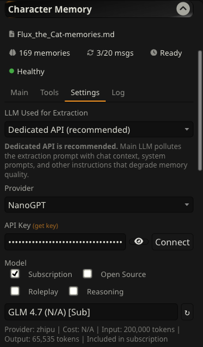

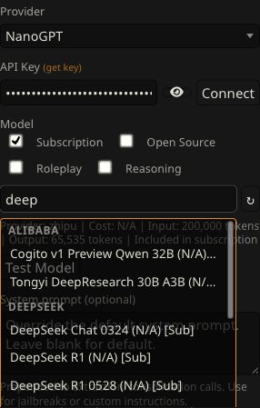

If your provider isn't listed, select **Custom** from the Provider dropdown. You can enter any OpenAI-compatible API base URL and it will work as long as the endpoint supports the `/chat/completions` format. Most LLM providers use this standard.

**Note on Local Server**: Select "Local Server" from the Provider dropdown to use Ollama, KoboldCpp, llama.cpp, or LM Studio. The Base URL field appears automatically — adjust the port to match your backend:

| Backend | Default URL |
|---------|-------------|
| KoboldCpp | `http://localhost:5001/v1` |
| llama.cpp | `http://localhost:8080/v1` |
| LM Studio | `http://localhost:1234/v1` |
| Ollama | `http://localhost:11434/v1` |

You can also use a LAN IP (e.g., `http://192.168.1.50:5001/v1`) if the server is running on another machine. No API key is needed. Click **Connect** to fetch available models, then select one and **Test Model**.

**Note on NVIDIA**: NVIDIA's API doesn't support CORS (browser-to-API requests), so CharMemory automatically routes NVIDIA requests through SillyTavern's server. This happens transparently — no extra setup is needed, just select NVIDIA, enter your API key, and go. Your API key is passed securely via headers and never touches SillyTavern's own configuration.

**Note on Pollinations**: Pollinations is a free provider that requires no API key — useful for trying CharMemory without signing up for anything. Select Pollinations, type a model name (e.g., `openai`), and go. Quality depends on which model Pollinations routes to, so it's best for testing rather than production use.

If you're not sure which model to use, see the [Recommended Models](#recommended-models) section below.

### Step 3: Chat Normally

That's it for basic setup. Now just chat with a character as you normally would.

As you chat, open the extension to watch the **stats bar** at the top of the CharMemory panel. You'll see the extraction progress counter tick up with each character message (e.g., "5/20 msgs"). When the counter reaches the threshold (default: 20 messages), CharMemory will automatically extract memories from the conversation.

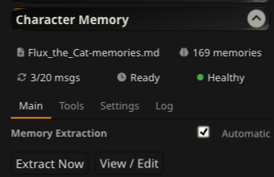

#### What the Stats Bar Shows

- **File name**: The memory file for the current character (e.g., `Flux_the_Cat-memories.md`). This is auto-generated from the character name, but you can set a custom name in Settings → Storage → File name override.
- **Memory count**: Total individual memory bullets stored
- **Progress**: Messages since last extraction vs. the auto-extract threshold (e.g., "1/20 msgs")
- **Status**: "Ready" when extraction can fire, or a cooldown timer
- **Health**: A colored dot indicating injection health — green (all checks passed), yellow (warnings), red (problems detected), or gray (not yet evaluated). Click it to jump to the Diagnostics panel for details. See [Injection Health Score](#injection-health-score) below.

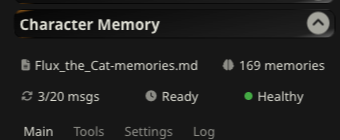

#### Your First Extraction

You don't have to wait for the auto-extraction threshold. There are two ways to extract right away:

1. **Extract Now** (button at the top of the CharMemory panel) processes all unprocessed messages in the entire chat. Click it, and you'll see a toast notification with how many memories were saved.

2. **Extract Here** (brain icon on any character message) processes all unprocessed messages up to and including that specific message. This is useful when you want to extract from a particular point in the conversation without processing everything after it.


You can follow either extraction in real time in the **Activity Log** (Tools → Activity Log). It shows each step: messages collected, LLM call sent, response received, and memories saved.

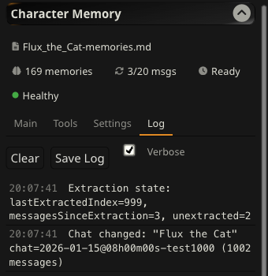

### Step 4: View Your Memories

Click **View / Edit** to open the Memory Manager. Your extracted memories appear as cards grouped by extraction, showing the chat name and timestamp. Blocks are displayed in reverse chronological order — newest extractions first, so the most recent memories are always at the top. Each bullet has its own edit and delete buttons.

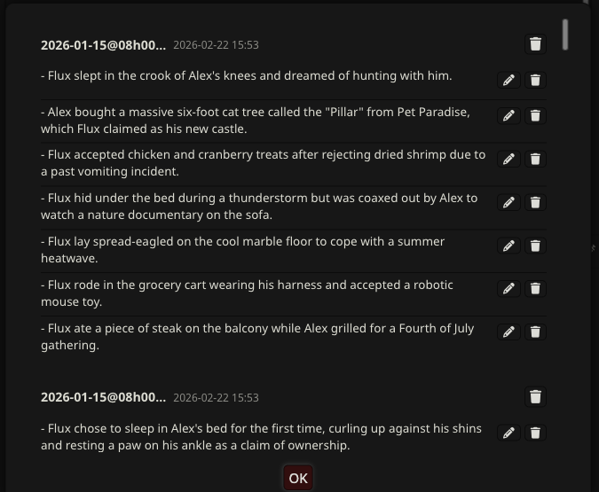

You can **edit** any bullet to refine its wording, or **delete** bullets that aren't useful. If a block becomes empty after deleting all its bullets, it's removed entirely.

Since memories are stored as a plain markdown file in the character's Data Bank, you can also edit the file directly if you prefer. Open the character's Data Bank panel (the paperclip icon), find the memory file, and edit it in any text editor. The Memory Manager is simply a more convenient interface for the same file.

### Step 5: Set Up Vector Storage

Extracting memories is only half the story. For your character to actually *use* those memories during conversation, you need **Vector Storage** enabled.

Vector Storage is a standard extension that ships with every SillyTavern installation — you don't need to install anything extra. It converts memories into embeddings (numerical representations) and retrieves the most relevant ones when the character generates a response.

Without Vector Storage enabled for Data Bank files, memories are stored but never injected into the LLM's context — the character won't recall them.

#### Enable Vector Storage

1. In the **Extensions** panel, find **Vector Storage** and expand it
2. Choose a **Vectorization Source**. The simplest option is **Local (Transformers)** — runs in your browser, no API key needed. Local vectorization is perfectly adequate for CharMemory (see note below).
3. Under **File vectorization settings**, check **Enable for files** — this is the critical setting. CharMemory stores memories as Data Bank files, so this must be on.
4. Configure the **Data Bank files** settings as shown below


#### Recommended Starting Settings

The Vector Storage panel has two rows of file settings: **Message attachments** (top) and **Data Bank files** (bottom). CharMemory uses the Data Bank, so focus on the bottom row:

| Setting | Starting value | What it does |
|---------|---------------|--------------|
| **Size threshold** | 1 KB | Files smaller than this get one embedding. At 1 KB, Vector Storage starts chunking so it can retrieve *specific* memories instead of the whole file. |
| **Chunk size** | 1000 chars | Each chunk gets its own embedding. With topic-tagged blocks (~200-400 chars each), 1000 fits 2-3 blocks per chunk — enough for clean retrieval without splitting blocks mid-sentence. |
| **Chunk overlap** | 0% | Overlap copies the end of each chunk into the start of the next. With small topic-tagged blocks, 0% works well. If you see blocks getting split (check [Injection Viewer](#injection-viewer)), try 10-15%. |
| **Retrieve chunks** | 2 | How many chunks are injected per generation. At 2-3 blocks per chunk, this gives ~4-6 memory blocks per message — enough context without flooding the prompt. |
| **Score threshold** | 0.3 | Filters out low-relevance chunks. Without this, Vector Storage injects whatever it has, even irrelevant memories. Start at 0.3 and lower if too few memories are injected — see [Tuning Vector Storage](#tuning-vector-storage). |
| **Query messages** | 1 | How many recent chat messages are used as the search query. 1 means only the latest message drives retrieval — keeps results focused on the current topic. Higher values blend recent context together, which can dilute the search. |

These are starting points, not universal answers. The right values depend on your embedding model, memory file size, and how your character's memories are structured. See [Tuning Vector Storage](#tuning-vector-storage) for how to test and adjust.

#### Choosing an Embedding Source

The embedding model determines how well Vector Storage can distinguish relevant memories from irrelevant ones. This matters more than you might expect — the wrong model can mean your character recalls vaguely related memories instead of the specific ones that matter.

| Source | Quality | Speed | Cost | Best for |
|--------|---------|-------|------|----------|
| **Local (Transformers)** | Adequate | Slow | Free | Getting started, privacy, small memory files |
| **OpenAI** | Excellent | Fast | ~$0.01/1M tokens | Best retrieval quality, large memory files |
| **NanoGPT** | Excellent | Fast | Pay-as-you-go | Same API key for extraction and embedding |
| **Ollama** | Good–Excellent | Fast | Free (local GPU) | Good quality without API costs |
| **Cohere / Jina / Voyage** | Good–Excellent | Fast | Free tier / cheap | Alternatives if you already use one |

**Model recommendations:**

- **Local Transformers**: The default model (`all-MiniLM-L6-v2`, 384 dimensions) works for getting started but has lower discrimination than larger models. If you stay on local, check if your SillyTavern version offers `nomic-embed-text` or `bge-base-en-v1.5` (768 dimensions) as alternatives.
- **OpenAI / NanoGPT**: `text-embedding-3-small` is the best balance of quality, speed, and cost. Memory files are tiny — even hundreds of blocks cost fractions of a cent to embed. If you already use **NanoGPT** for extraction, you can use the same API key for embedding — select it as your vectorization source in Vector Storage and it provides `text-embedding-3-small` among its available models.
- **Ollama**: `nomic-embed-text` is a good local option with better quality than the default browser model.

For most users, **`text-embedding-3-small`** (via OpenAI or NanoGPT) or **`nomic-embed-text`** (via Ollama) will give noticeably better retrieval than the default local model — especially as your memory file grows past 50+ blocks.

#### Verify It's Working

After extracting some memories and chatting further, the quickest check is the **health dot** in the CharMemory stats bar — green means your Vector Storage settings are correct and memories are being injected. If it's yellow or red, click it to jump to Diagnostics where each issue is explained with a recommendation. See [Injection Health Score](#injection-health-score) for details on what it checks.

For a deeper look, use [Diagnostics](#using-diagnostics) to see the exact memories that were injected in the last generation, or the [Injection Viewer](#injection-viewer) to inspect what any specific past message received.

---

## Per-Message Buttons

Each message in your chat has two extra buttons (visible when you hover over the message):

1. **Extract Here** (brain icon, character messages only)
Runs LLM-based extraction on all unprocessed messages up to and including this one. Useful for targeting a specific point in a long conversation. Uses the same provider and settings as auto-extraction.

2. **Pin as Memory** (bookmark icon, all messages)
Manually saves a message as a memory with no LLM involved. Opens an edit dialog pre-filled with the message text so you can rewrite it however you want before saving. Each line becomes a memory bullet. Use this when you want to remember something specific exactly as you phrase it.

---

## Group Chats

CharMemory works in group chats with no extra setup. Each group member gets their own memory file, and extraction handles all members in a single pass. The Settings panel automatically adapts to show group-specific options (member file names, group extraction prompt) when a group chat is active, and 1:1 options when a solo chat is active.

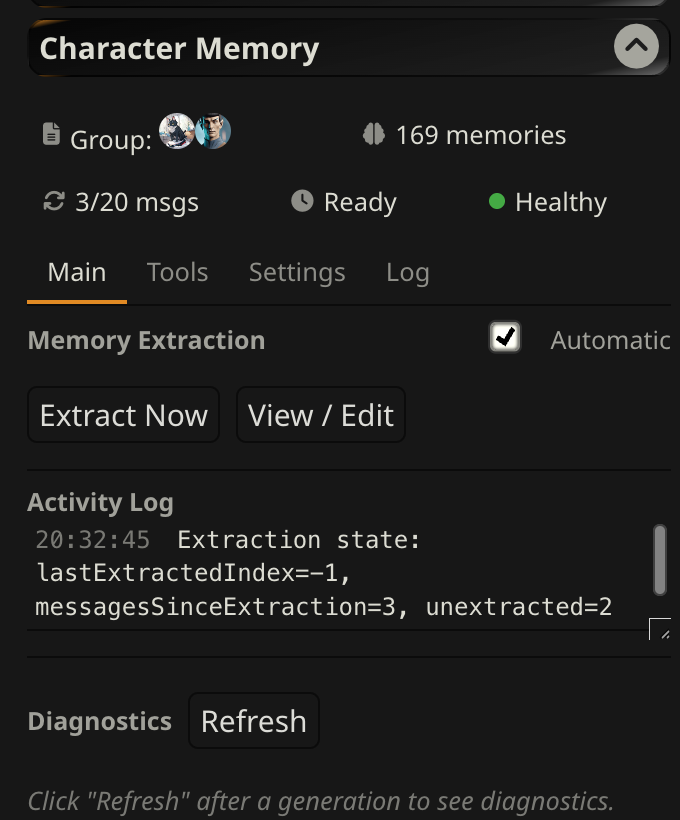

### How It Works

When extraction fires in a group chat — whether automatically or via Extract Now — CharMemory processes each chunk of messages once per group member. For each member, it:

1. Reads that character's existing memories
2. Builds an extraction prompt that includes the character card and a participant list so the LLM knows who is speaking
3. Sends the chunk to the LLM
4. Appends any new memories to that character's file

Progress shows which character is being processed (e.g., "Alice (2/6)"). If the LLM call fails for one member, extraction continues with the remaining members — one failure won't abort the entire group.

### Viewing and Editing Group Memories

Click **View / Edit** in a group chat and you'll see per-character sections, each with their own memory cards. Edit and delete controls work the same as in 1:1 — they target the correct character's file based on which section the button is in.

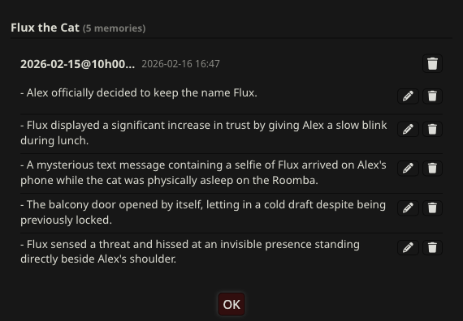

Newest memory blocks appear first (reverse chronological) in both 1:1 and group chats.

### Consolidation in Groups

The Consolidate button in a group chat shows a character picker — select which character's memories to consolidate. Consolidation works on one character at a time to keep the preview manageable. Undo restores that character's previous memories.

### Pin Memory in Groups

The bookmark button on a group message routes the pinned memory to the correct character's file based on the message sender. If the sender can't be matched to a group member (e.g., a narrator message), it goes to the first member.

### Per-Character Filenames

By default, each group member's memory file is auto-named from their character name (e.g., `Alice-memories.md`). You can configure custom filenames per character in Settings when a group chat is active.

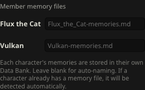

### How Memory Retrieval Works in Groups

During generation, SillyTavern sets the active character to whichever group member is about to speak. Vector Storage then retrieves memories from that character's Data Bank and injects them into the prompt. This means each character gets their own memories when it's their turn to generate — Vulkan gets Vulkan's memories, Flux gets Flux's.

**Diagnostics caveat:** After generation finishes, SillyTavern resets the active character to none. If you click Diagnostics → Refresh between generations, the "Injected Memories" section may appear empty because there's no character context at that moment. This doesn't mean memories weren't injected — it just means the diagnostics snapshot was taken outside of a generation turn.

### Reset and Clear in Groups

**Reset Extraction State** in a group chat clears tracking for all group members, not just one.

**Clear All Memories** deletes memory files for all group members in the current group.

---

## Other Features

### Batch Extraction

If you have existing chats with a character, you don't need to manually extract each one. Batch extraction processes multiple chats at once:

1. Open **Tools** tab → **Batch** pill
2. Click **Refresh** to load the list of chats for the current character
3. Select the chats you want to extract (use **Select All** to check all of them)
4. Click **Extract Selected** — a confirmation popup shows the total message count
5. Progress updates show which chat is being processed and chunk progress
6. Use **Stop** to cancel mid-extraction — progress is saved per-chunk, so you won't lose work

Each chat's extraction state is tracked separately. Re-running batch extraction only processes new messages since the last run — it won't re-extract messages that have already been processed.

#### Expectations for Long Existing Chats

Batch extraction works best for catching up on recent unprocessed chats. For very long existing chats (hundreds of turns), results may be sparser than you'd expect. This is by design — the LLM only sees one chunk at a time and can't assess significance across the full conversation arc the way it can when extracting incrementally as you chat.

CharMemory works best when it extracts **as you go** — each extraction builds on the previous memories, and the LLM has both the existing memories and the current chunk to work with. When starting fresh on a very long chat, the early chunks have no existing memories for context, so the LLM may miss details that only become significant later.

If batch extraction of a long chat produces too few memories, try:
- **Increasing "Messages per LLM call"** — giving the LLM a bigger window (40–50 messages) helps it identify more significant events per chunk
- **Running consolidation after extraction** — this can merge and refine the sparse results
- **Starting a new chat with the character** — incremental extraction as you chat naturally produces the best results over time

### Resetting Extraction State

Two reset options are available in Settings:

**Reset Extraction State** resets the extraction tracking for the current character — both the active chat and all batch extraction state. After resetting, the extension treats all messages as unprocessed. This is useful when you want to re-extract from the beginning, perhaps after changing the extraction prompt or switching to a better model. It does **not** delete any memories. In group chats, this resets tracking for all group members.

**Clear All Memories** deletes the memory file and resets all extraction tracking. In default mode (not per-chat), the memory file contains memories from **all** of that character's chats, so this clears everything. This cannot be undone. In group chats, this deletes memory files for all group members.

### Consolidation

When the memory file grows large with many extraction blocks, related or duplicate memories can accumulate across different sessions. The **Consolidate** tool (**Tools** tab → **Consolidate** pill) lets you send the full memory file to the LLM to deduplicate and combine related entries.

Consolidation is always manual — it never runs automatically.

#### Strategy Presets

Before consolidating, choose a strategy from the dropdown (**Tools** tab → **Consolidate** pill):

| Strategy | What it does |
|----------|-------------|
| **Conservative** | Only merges near-exact duplicates. Safest option — preserves the most detail. |
| **Balanced** | Merges duplicates and combines related facts. Good default. |
| **Aggressive** | Compresses heavily, summarizes by theme. Best for very large memory files that need significant reduction. |

Each preset has its own prompt that you can view and customize. Click the expand arrow to see the full prompt, edit it to taste, and save. **Restore Default** reverts a preset to its original prompt.

#### The Consolidation Workflow

1. Pick a strategy and click **Consolidate**
2. The LLM processes your memories and returns a consolidated version, organized by theme (e.g., "Relationship History", "Key Events")
3. Results appear as **editable cards** — not raw text. Each theme block is read-only by default; click the **pencil icon** on any block to enter edit mode for that block
4. You can **edit** individual bullets, **delete** bullets or entire blocks, **add** new bullets, and **rename theme headers** before applying
5. Not happy with the result? Click **Re-run** to get a fresh consolidation. Each re-run saves the previous version to a **version stack** — click **Undo** to step back through prior versions
6. When satisfied, click **Apply** to write the consolidated memories to the file

**Back up your memory file before consolidating**, especially if you have a large number of memories. The undo is session-only — if you close SillyTavern, the backup is lost. To back up: open the character's Data Bank (paperclip icon) and download the memory file.

In group chats, consolidation shows a character picker — select which character's memories to consolidate. See [Group Chats](#group-chats) for details.

Consolidation automatically uses 2x your configured "Max response length" as its token budget, since it processes the full memory file rather than a single chunk. If you're using a thinking model, this means consolidation gets even more headroom (e.g., 2000 response length → 4000 tokens for consolidation).

Results vary depending on the model used and the size of the memory file. Review the preview carefully before applying.

### Convert

The **Convert** tool handles two tasks from a single interface:

- **Reformat current memories** — restructure existing memories to the v1.7.0 topic-tagged format for better vector retrieval
- **Import a Data Bank file** — convert notes, lists, or other text files into CharMemory's `<memory>` tag format

Open **Tools** tab → **Convert** pill → choose a **source**:

| Source | What it does |
|--------|-------------|
| **Current memories** | Sends your existing memory file through the LLM to add topic tags, trim blocks, and use specific names. Overwrites the memory file (with one-click Undo). |
| **Data Bank file** | Select any file from the character's Data Bank. Detects the format automatically. Appends converted memories to your CharMemory file — the original is never modified. |

**Using the Convert tool:**

1. Select a source (current memories or Data Bank file)
2. For Data Bank files, optionally check **Use LLM to restructure** — recommended for freeform text
3. Edit the **prompt** if needed (always visible — no need to expand a disclosure)
4. Click **Preview** — a popup dialog opens with original content on the left and converted memories as editable cards on the right
5. Edit, delete, or add blocks and bullets before saving
6. Click **Re-run** to try again (with Undo to step back through versions)
7. Click **OK** to save, or **Cancel** to discard

The Convert tool detects 6 input formats automatically for Data Bank files:

| Format | Example |
|--------|---------|
| CharMemory `<memory>` tags | Already in format — no conversion needed |
| Old CharMemory (`## Memory N`) | Auto-migrated |
| Bullet lists (`- ` or `* `) | Each bullet becomes a memory |
| Numbered lists (`1.`, `2)`) | Each item becomes a memory |
| Markdown with headings | Headings become block themes |
| Freeform text | Split on sentences (use LLM for better results) |

**For Data Bank imports**: the original file is never modified or deleted. After converting, hide or remove the original from the Data Bank to avoid duplicate memories being injected.

### Per-Chat Memories

By default, all chats for a character share one memory file. Enable **Separate memories per chat** in Settings → Storage to give each conversation its own file. This is useful when the same character appears in different scenarios or timelines that shouldn't share context.

This also works in group chats — each group member gets a separate per-chat memory file.

### Custom File Names

The memory file is auto-named from the character name (e.g., `Flux_the_Cat-memories.md`). You can override this in Settings → Storage → **File name override**. This is useful if you want a more descriptive name or if you're managing multiple memory files manually.

### Slash Commands

| Command | Description |
|---------|-------------|
| `/extract-memories` | Force extraction regardless of interval |
| `/consolidate-memories` | Consolidate memories by merging duplicates |
| `/charmemory-debug` | Capture diagnostics and dump to console |

---

## Using Diagnostics

The **Diagnostics** tab (Tools → Diagnostics) shows you exactly what the LLM saw during its last generation. This is the single best tool for answering "why isn't my character remembering X?" or "what memories are actually being used?"

Click **Refresh** after generating a message to capture the current state.

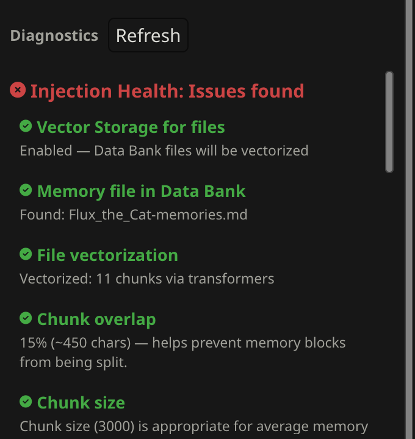

### What Diagnostics Shows

**Memories** — The active memory file name, whether it exists in the Data Bank, total memory count (bullets and blocks), and vectorization status (including chunk count and embedding source). This tells you whether your memories are stored and indexed correctly.

**Injected Memories — Last Generation** — The specific memory bullets that Vector Storage retrieved and sent to the LLM for the most recent generation. This is the most important section — it shows you exactly which memories the character had access to when it wrote its last response. If a memory exists in the file but doesn't appear here, it either wasn't semantically relevant to the current conversation or Vector Storage settings need adjustment.

**Character Lorebooks** — A static list of all World Info / lorebook books bound to the current character, with entry counts and trigger keys. This appears in diagnostics because lorebook entries and memories both get injected into the LLM's context, and they can interact — a lorebook entry might provide world-building context that complements a memory, or they might conflict. Seeing both in one place helps you understand the full picture of what supplemental context the character has.

**Activated Entries — Last Generation** — Which specific lorebook entries actually fired during the last generation, based on their trigger keys matching the conversation. Unlike the static list above, this shows what was *actually injected* — so you can see if a lorebook entry you expected to fire didn't, or if unexpected entries are crowding out memory context.

**Extension Prompts** — All content injected by extensions (including Vector Storage's memory retrieval and any other active extensions). This is the raw view of everything beyond the base conversation that the LLM received. The `4_vectors_data_bank` entry shows the full content retrieved by Vector Storage — this is what gets injected into the LLM's context alongside the conversation.

**Injection Health** — A health card showing the results of automated checks on your Vector Storage configuration. Each check is color-coded (green/yellow/red) with an explanation and recommendation if something needs attention. See [Injection Health Score](#injection-health-score) for details on each check.

**Note on group chats**: In group chats, Diagnostics shows memory info for the first group member only. To check a specific character's memories, use View/Edit which shows all members.

### Why Memories and Lorebooks Both Appear

CharMemory's diagnostics shows both memories and lorebooks because they're the two main sources of supplemental character context that get injected alongside the conversation. When debugging "the character doesn't remember X" or "the character is acting strangely," the answer often involves the interaction between these sources — not just one in isolation. The diagnostics panel gives you a single place to inspect everything the LLM saw beyond the chat messages themselves.

---

## Injection Viewer

The **Injection Viewer** is a side drawer that shows you exactly what context was injected for any specific message. While Diagnostics gives you a snapshot of the *latest* generation, the Injection Viewer lets you inspect *any* past message — making it easy to compare what changed between generations.

### Opening the Viewer

On each character message, you'll see a small pen/quill icon (next to the edit and menu buttons). Click it to open the Injection Viewer drawer on the right side of the chat. The drawer title shows which message you're inspecting (e.g., "Message #999").

You can also open the drawer from the small toggle tab on the right edge of the chat area, then click the icon on any message to load its data.

### What the Viewer Shows

The drawer has three collapsible sections:

**CharMemory** — The specific memory bullets that Vector Storage retrieved and injected for this generation. Each bullet is listed individually with a count in the header (e.g., "CharMemory (17)"). This is the most direct answer to "what did my character remember when writing this message?"

**Lorebook Entries** — Which World Info / lorebook entries were activated for this generation, based on keyword triggers matching the conversation. Each entry shows its name, trigger keys, and a preview of its content. If a lorebook entry you expected to fire isn't listed here, its keywords didn't match the recent conversation context.

**Extension Prompts** — The raw content injected by all extensions, keyed by their injection position (e.g., `4_vectors_data_bank` for Vector Storage, `2_floating_prompt` for Author's Note). This is the unprocessed view — useful for seeing the exact text the LLM received, including `<memory>` block markup and chunk boundaries.

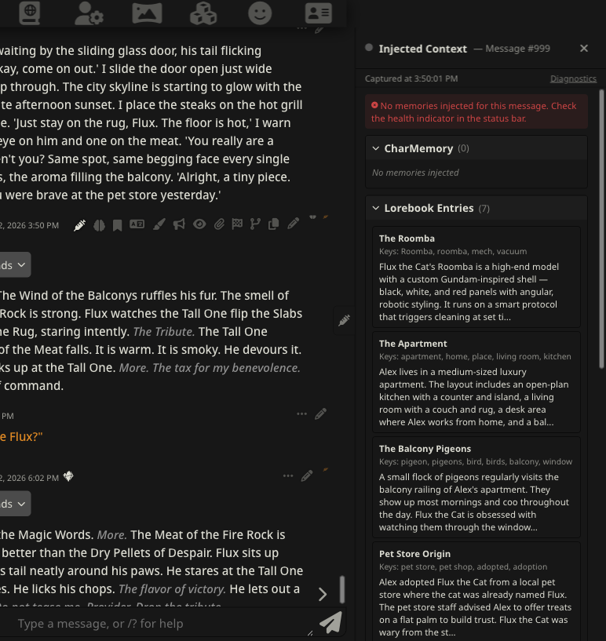

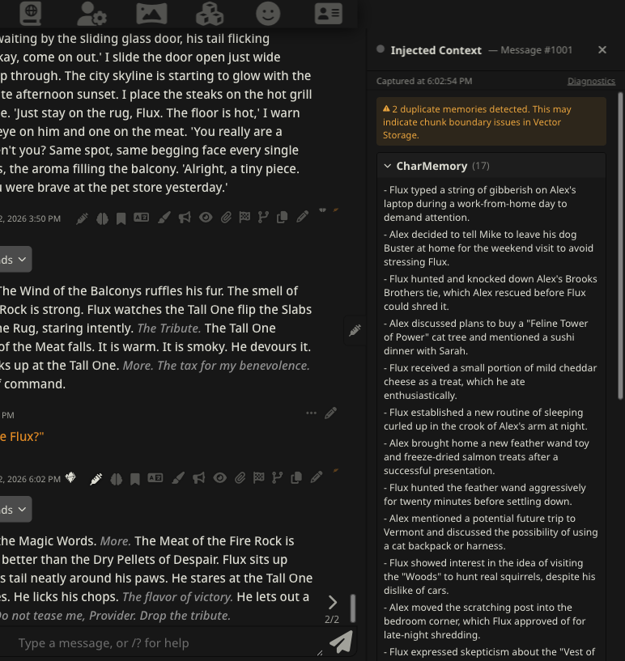

### How Data is Captured

Injection data is captured automatically at generation time — when the character produces a response, CharMemory takes a snapshot of all injected context at that moment. This means:

- **Only character messages have injection data** — user messages don't trigger a generation, so there's nothing to capture
- **Older messages may not have data** — snapshots are only captured while the extension is installed and active. Messages generated before installation show "Click the icon on a message to view its injected context"
- **Data persists for the session** — injection snapshots are stored in chat metadata, so they survive page refreshes within the same chat

### Closing the Viewer

Click the **X** button in the top-right corner of the drawer, or **swipe right** on the drawer (touch devices).

### Toolbar

Just below the header, a toolbar shows the capture timestamp and a **Diagnostics** link:

- **On desktop**: Clicking "Diagnostics" opens the Extensions panel and scrolls to the CharMemory diagnostics section.
- **On touch devices** (iPad, phones): Clicking "Diagnostics" shows an inline health summary directly in the drawer — no need to navigate away from the chat. Tap it again to dismiss.

### Using Injection Viewer with Diagnostics

The Injection Viewer and Diagnostics serve complementary purposes:

| | Injection Viewer | Diagnostics |
|---|---|---|
| **Scope** | Per-message — inspect any past generation | Latest generation only |
| **Detail** | Parsed sections (memories, lorebooks, prompts) | Full system overview (file status, vectorization, health) |
| **Best for** | "What did the character know when it wrote *this* message?" | "Is my setup working correctly?" |
| **Access** | Pen icon on any character message | Tools → Diagnostics → Refresh |

For a complete picture, use both: Diagnostics to verify your setup is healthy, and the Injection Viewer to spot-check individual messages.

---

## Injection Health Score

The **Health Score** is a traffic-light indicator that automatically checks whether your Vector Storage settings are configured correctly for CharMemory. It surfaces problems and recommendations so you don't have to manually inspect raw injected content.

### Where It Appears

- **Stats bar** — A colored dot as the 5th item in the CharMemory stats bar. Click it to scroll directly to the Diagnostics panel for details.
- **Injection Viewer drawer** — A colored dot in the drawer header, with a tooltip showing injection-specific stats (memories injected, duplicates detected). This dot stays gray until a generation has been captured. On touch devices, the "Diagnostics" link in the toolbar also shows the full health check results inline.
- **Diagnostics panel** — A detailed health card showing each check with its status and recommendations.

### Health Levels

| Color | Meaning |
|-------|---------|
| **Green** | All checks passed — your setup looks good |
| **Yellow** | Warnings — things work but could be improved |
| **Red** | Problems — something is preventing memories from being injected correctly |
| **Gray** | Not yet evaluated — no character selected or no generation captured |

### What It Checks

The health score runs up to 7 checks, depending on what data is available:

| Check | What it looks for | When it's a problem |
|-------|-------------------|---------------------|
| **Files enabled** | "Enable for files" is checked in Vector Storage | RED if disabled — memories are stored but never retrieved |
| **Memory file exists** | A memory file exists in the character's Data Bank | RED if missing — nothing to vectorize |
| **File vectorized** | The memory file has been chunked into vectors | RED if 0 chunks — file exists but hasn't been processed |
| **Chunk overlap** | Vector Storage's Data Bank overlap setting | YELLOW if 0% — memory blocks on chunk boundaries get split, causing duplicates |
| **Chunk size** | Vector Storage's Data Bank chunk size | YELLOW if too small (blocks get split) or too large (loses retrieval granularity) |
| **Memories injected** | Whether memory bullets appeared in the last generation | RED if file exists and is vectorized but 0 memories were injected |
| **Duplicate detection** | Whether the same bullet appears multiple times in injected content | YELLOW if duplicates found — usually means chunk overlap or chunk size needs adjustment |

Checks 1–5 run immediately when you open a chat. Checks 6–7 only run after a generation has been captured (since they inspect injected content).

### Acting on Health Warnings

**RED: Files not enabled** — Open Extensions → Vector Storage → check "Enable for files" under File vectorization settings.

**RED: Memory file not found** — Run an extraction first (Extract Now or wait for auto-extraction). The memory file is created on first extraction.

**RED: File not vectorized** — The file exists but hasn't been processed. Try generating a message (Vector Storage processes files on generation), or check that your vectorization source is configured and working.

**YELLOW: Chunk overlap is 0%** — Open Vector Storage → Data Bank files row → increase the overlap setting. 15% is a good starting point. Without overlap, `<memory>` blocks that land on a chunk boundary get split between two chunks, and neither half retrieves cleanly — this is the most common cause of duplicate memories in injected content.

**YELLOW: Chunk size issues** — If too small, individual memory blocks get split across chunks. If too large, you lose retrieval granularity (Vector Storage retrieves whole chunks, so a huge chunk means lots of irrelevant context). See [Recommended Vector Storage Settings](#recommended-vector-storage-settings) for guidance.

**YELLOW: Duplicates detected** — The same memory bullet appeared multiple times in the injected content. This usually means chunk boundaries are splitting `<memory>` blocks. Increase chunk overlap and/or adjust chunk size so blocks fit cleanly within chunks. After changing settings, purge vectors and revectorize the file.

---

## Understanding the Extraction Settings

Once you're up and running, you may want to tune how often and how extraction happens. Open **Settings** in the CharMemory panel.

### Auto-Extraction Timing

Two sliders control when automatic extraction fires:

**Extract after every N messages** (default: 20, range: 3–100)
How many character messages must arrive before auto-extraction triggers. A higher value gives the LLM more context per extraction, which generally produces better, more selective memories. A lower value extracts more frequently with less context.

**Minimum wait between extractions** (default: 10 min, range: 0–30 min)
A cooldown that prevents rapid-fire extractions during fast-paced chats. When the message threshold is reached, extraction only fires if this much wall-clock time has passed since the last one. If the cooldown hasn't expired, extraction is skipped (not queued) and checks again on each subsequent message. Messages keep accumulating during the cooldown, so when it finally fires, it processes everything that piled up.

These two settings **only affect automatic extraction**. Manual "Extract Now", per-message "Extract Here", and batch extraction always run immediately.

### Extraction Quality

**Messages per LLM call** (default: 20, range: 10–200)
Controls how many messages are sent to the LLM in a single extraction call. If there are more unprocessed messages than this, extraction loops through them in chunks. Larger chunks give the LLM more context per call and can produce better memories, but too many messages can cause timeouts with some providers.

In the common auto-extraction case, only N messages (the interval threshold) will have accumulated, so this slider is irrelevant — the chunk size only kicks in when messages pile up beyond the interval, during manual extraction of long chats, or during batch extraction.

The right value depends on your chat style. If your character writes long, detailed responses, 20 messages might already be a lot of text. If both sides write short messages, you may want to increase this to 40–50 so the LLM has enough context to judge what's significant. The test is to look at the memories it creates — if they're too granular (trivial details), increase this. If extractions are timing out, decrease it.

You can check your memories either using the **View/Edit** button in the extension panel, or by going to the character's Data Bank (magic wand icon → Open Data Bank → Character Attachments) and clicking the pencil icon on the memory file.

Setting this too low (e.g., 10) gives the LLM too little context — it extracts trivial details because there isn't enough conversation to judge what's significant. Setting it too high (150+) doesn't improve quality, increases token costs, and may cause timeouts with some providers.

**Max response length** (default: 1000 tokens, range: 100–4000)
Token limit for the LLM's response per chunk. Most models produce well-formed output within 1000 tokens. **Reasoning/thinking models** (like GLM-4.7 on NVIDIA) need significantly more — their internal reasoning consumes tokens before producing the actual output. If you're using a thinking model and getting empty extractions, increase this to 2000–3000.

**Merge extraction chunks** (default: off)
When a chat has more unprocessed messages than the chunk size, extraction runs in multiple passes. With this off (default), each chunk's memories are stored as separate `<memory>` blocks — keeping them small and manageable for consolidation. With this on, blocks from the same chat are merged into a single block after extraction. Leave this off for long chats (hundreds of messages) where consolidation would be valuable — large merged blocks can exceed the consolidation LLM's capacity.

### How the Settings Interact

The three main sliders — **Extract after every N messages** (interval), **Minimum wait between extractions** (cooldown), and **Messages per LLM call** (chunk size) — work together:

**Interval and chunk size.** The extension tracks a `lastExtractedIndex` watermark. Each message is only ever sent to the LLM once — there is no overlap between extractions. When auto-extraction fires after N messages, only those N unprocessed messages are sent, even if the chunk size is larger. This means that with the defaults (interval=20, chunk size=20), each auto-extraction sends exactly 20 messages to the LLM. The chunk size only becomes relevant when more messages accumulate than the interval — for example, during manual "Extract Now" after a long chat, batch extraction, or when the cooldown delayed auto-extraction and messages piled up.

**Why the interval matters for quality.** A higher interval gives the LLM more messages per extraction, which means more context to judge what's significant. With only 10 messages, the LLM has little to work with and may extract minor details. With 20–50 messages, it can better identify meaningful developments and skip filler.

**How cooldown works.** When the message counter hits the interval threshold, the extension checks whether enough wall-clock time has passed since the last extraction. If not, extraction is **skipped** (not queued). The counter stays above the threshold, so it checks again on each subsequent message until the cooldown expires. During this time, messages keep accumulating. When extraction finally fires, it processes everything that piled up — potentially sending more than N messages and using the chunk size to split them into multiple LLM calls.

**Practical examples:**
- *Fast chat, defaults (interval=20, cooldown=10min):* 20 messages arrive in 3 minutes. Extraction wants to fire but cooldown blocks it. By the time 10 minutes pass, 60 messages have accumulated. Extraction fires and processes all 60 in three chunks of 20.
- *Leisurely chat, defaults:* 20 messages arrive over 45 minutes. Cooldown is long expired. Extraction fires immediately and processes 20 messages in one call. The chunk size is irrelevant.
- *High interval (interval=50, cooldown=0):* Extraction fires every 50 messages with no time gate. Each extraction has rich context and produces higher-quality, more selective memories.

---

## The Extraction Prompt

The extraction prompt is the core of what makes CharMemory produce useful memories rather than a play-by-play transcript. You can view and edit it in Settings → Extraction Prompt, and a **Restore Default** button lets you start over.

The default prompt was developed through extensive testing across multiple models and character types. Here's what it does and why:

**Three-section input structure.** The prompt gives the LLM three clearly bounded sections: the character card (baseline knowledge), existing memories (already recorded), and recent chat messages (what to extract from). Each section has explicit `=====` boundary markers and instructions about what to do with it — extract only from recent messages, don't repeat existing memories, and don't re-state character card traits.

**Why the character card is included.** Early versions without the card produced memories that re-extracted baseline traits. If a character's card says "she's a doctor," the LLM would extract "she works in medicine" from every chat where it came up. Including the card as "baseline knowledge — do NOT extract" dramatically reduced this.

**The "would they bring this up months later?" test.** The prompt asks the LLM to evaluate each potential memory against this question. This pushes models toward significant, lasting facts and away from moment-by-moment details.

**Hard 8-bullet limit.** Without a cap, most models produce 15-20 bullets per extraction — far too granular. The 8-bullet limit forces the LLM to prioritize. If a conversation doesn't contain 8 significant things, the LLM can return fewer.

**Negative and positive examples.** The prompt includes a bad example (step-by-step play-by-play of a scene) and a good example (the same scene condensed to 2 bullets capturing outcomes). This was the single most effective change for reducing play-by-play extraction, which was the most common quality problem across models.

**"Write what happened, not that it was discussed."** Models tend to write meta-narration like "she told him about her childhood" instead of the actual fact "she grew up in a coastal village." The prompt explicitly addresses this pattern.

**Date/time extraction.** The prompt encourages the LLM to capture dates and times when they are mentioned or clearly implied in conversation, adding temporal context to memories (e.g., "In March, she moved to the coast" rather than just "She moved to the coast").

If you customize the prompt, keep the three-section structure and boundary markers intact — models rely on these to understand what to extract from and what to skip.

**Group chats use a separate prompt.** When a group chat is active, the Settings panel shows a **Group Extraction Prompt** instead of the 1:1 prompt. The label changes to "Extraction prompt (group chats)" so you always know which prompt you're editing. It follows the same principles but adds a `{{participants}}` list so the LLM knows who is speaking, and instructs it to attribute memories to specific characters by name. The two prompts are completely independent — customizations to the 1:1 prompt are not inherited by the group prompt, and vice versa. If you want to apply the same change to both, you need to edit each one separately.

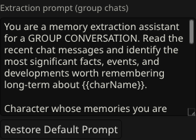

---

## Recommended Models

Memory extraction is a structured task — the LLM needs to follow instructions precisely, distinguish between existing and new content, and produce well-formatted output. Not all models are equally good at this.

### What matters most

1. **Instruction following**: The LLM must respect the AVOID list, past-tense requirement, and the boundary between existing memories and new chat content. Weaker models blur these boundaries and contaminate new extractions with rephrased existing memories.
2. **Factual accuracy**: The LLM must not reverse actions (e.g., "A did X to B" when B did X to A) or hallucinate events.
3. **Structured output**: The LLM must produce well-formed `<memory>` blocks with bulleted lists. Models that struggle with formatting produce unparseable output.

### Good choices

| Model | Notes |
|-------|-------|
| **GLM 4.7** | Best quality and fastest. Concise, significant memories. Recommended first choice. On NVIDIA, this model uses reasoning tokens — set Max response length to 2000–3000 (see below). On NanoGPT, it works at default settings. |
| **DeepSeek V3.1 / V3.2** | Good instruction following. Solid second choice. |
| **Mistral Large 3** | Good quality, sometimes verbose. |
| **GPT-4.1 nano / mini** | Reliable instruction following at low cost. |
| **Hermes 4 (405B)** | Good with roleplay-adjacent content, won't refuse. |
| **Llama 3.1 8B Instruct** | Fast and cheap. Works well on NVIDIA. Good for testing. |

### Reasoning/Thinking models

Some providers serve models with "thinking" or "reasoning" enabled by default (e.g., GLM-4.7 on NVIDIA). These models spend part of their token budget on internal reasoning before producing the actual output. CharMemory handles this transparently — it reads the reasoning output when the content field is empty. However, you need to increase **Max response length** to 2000–3000 so the model has enough budget for both reasoning AND the actual memory output. If you see "0 memories" with a thinking model, this is almost certainly the fix.

The verbose Activity Log will show `[reasoning: N chars]` when a model uses reasoning tokens, so you can tell at a glance what's happening.

**Disabling reasoning**: Some APIs let you turn off thinking mode via a request parameter. For GLM-4.7 on NVIDIA, you can try putting this in CharMemory's **System prompt** field in provider settings:
```
"thinking": { "type": "disabled" }
```
This may allow the model to use its full token budget for memory output instead of reasoning. Results may vary — if it doesn't help, increase the response length instead.

### Models to avoid

| Model | Issue |
|-------|-------|
| **Qwen3-235B** | Tends toward compressed play-by-play even with the improved prompt. |
| **Very small models** | May reverse who did what or blur the boundary between existing and new memories. |
| **Heavily censored models** | May refuse to extract from mature content, returning nothing even when there are real events to capture. |

---

## Memory File Format

CharMemory stores memories as plain markdown files in the character's Data Bank. Understanding the file format is useful if you want to edit memories manually, migrate existing files, or troubleshoot.

### Structure

Each extraction produces one or more `<memory>` blocks. Each block has a **topic tag** (first bullet) that anchors the block to a specific event or theme, followed by **content bullets** with the actual memories:

```
<memory chat="2026-02-15@10h00m00s" date="2026-02-15 14:30">
- [Alex, Flux — home office chaos]
- Alex works from home as a freelance designer.
- Flux knocked a coffee mug off Alex's desk without remorse.
- Alex adopted Flux from a rescue shelter two years ago.
</memory>

<memory chat="2026-02-15@10h00m00s" date="2026-02-15 15:45">
- [Flux — apartment exploration]
- Flux has been hiding treats behind the couch cushions.
- Flux rode the Roomba around the apartment for the first time.
</memory>
```

**Key details:**
- Each block is wrapped in `<memory>` tags with `chat` (the chat filename) and `date` (extraction timestamp) attributes
- The **first bullet** is a topic tag in `[Names — description]` format — this improves vector search by giving each block a clear semantic anchor
- Content bullets start with `- ` (dash space) — this is the only recognized format
- Blocks are limited to ~5 content bullets (not counting the topic tag) to keep them focused
- Multiple blocks from the same chat can optionally be merged (see "Merge extraction chunks" in Settings). This is off by default to keep blocks smaller for consolidation
- The file is append-only during normal operation — new extractions add blocks at the end
- Old files using the `## Memory N` heading format are auto-migrated on first read

### Chunk Boundary Settings

Vector Storage chunks your memory file on `\n\n` (double newline) boundaries. By default, each `<memory>` block is one chunk. If your memory file is large, you may want more granular chunking so Vector Storage retrieves individual bullets instead of entire blocks.

Open **Settings** → **Memory File Format**:

| Setting | Behavior |
|---------|----------|
| **Block-level** (default) | One chunk per `<memory>` block. Original behavior — unchanged from previous versions. |
| **Bullet-level** | Each bullet gets its own chunk. `<memory>` tags are preserved for round-trip safety, but `\n\n` is inserted between bullets so Vector Storage chunks them individually. |
| **Custom separator** | Blocks separated by a custom string (e.g., `\n---\n`). Use this if your Vector Storage chunking strategy uses a different boundary. |

**Include metadata in chunks**: When using bullet-level or custom chunking, enable this to prefix each bullet with `[date | chat_id]` so standalone vector chunks retain their provenance (which chat they came from and when they were extracted).

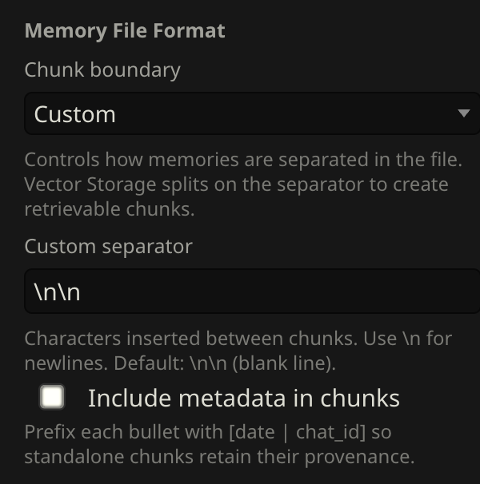

When you change the chunk boundary setting, CharMemory offers to **reformat** the existing memory file to match. This re-reads, re-parses, and re-serializes all memories with the new format. You can decline to keep the existing file as-is.

After reformatting, **purge vectors and revectorize** the file in Vector Storage so the index reflects the new chunk boundaries.

### Working with Existing Memory Files

CharMemory auto-detects existing `*-memories.md` files in a character's Data Bank. If you already have a memory file from manual notes or another tool, CharMemory will find and use it automatically rather than creating a duplicate — as long as the filename ends in `-memories.md`.

For CharMemory to parse the contents, the file needs to be in the `<memory>` block format. The easiest way to convert existing files is the [Convert / Import](#convert--import) tool in the **Tools** tab — it detects the format automatically and lets you preview and edit the result before saving.

To convert manually, wrap your text like this:

```
<memory chat="imported" date="2026-01-01">
- First memory bullet
- Second memory bullet
</memory>
```

Any text outside `<memory>` blocks is ignored by the Memory Manager and won't appear in diagnostics. It won't cause errors, but it also won't be managed by CharMemory.

After converting existing files or making manual edits, **purge vectors and revectorize** the file in Vector Storage so the index reflects the updated content. Vector Storage doesn't incrementally update — it re-chunks and re-embeds the entire file from scratch when you revectorize.

---

## Tuning Vector Storage

Vector Storage settings interact with your memory file format, embedding model, and character's memory content. There is no single "correct" configuration — you need to test and adjust for your setup. This section explains what each setting does, how to test whether it's working, and how to iterate.

### How Vectorization Works with CharMemory

The pipeline:

1. CharMemory extracts memories and writes them to a Data Bank file as `<memory>` blocks
2. Vector Storage reads the file and splits it into **chunks** based on `\n\n` (double newline) boundaries
3. Each chunk is sent to the **embedding model**, which converts it into a numerical vector
4. When the character generates a response, Vector Storage compares the current conversation against all stored vectors
5. The top-scoring chunks (above the **score threshold**) are injected into the LLM's context

The key insight: **each chunk gets one embedding**. If a chunk contains a single focused topic, the embedding accurately represents that topic and Vector Storage can retrieve it precisely. If a chunk mixes unrelated topics, the embedding becomes a blurry average and retrieval suffers.

This is why the v1.7.0 topic-tagged format matters — each block starts with a `[Names — topic description]` tag that anchors the embedding to a specific event or theme.

### Why Topic Tags Matter for Retrieval

Without topic tags, a character whose memories are all thematically similar (e.g., all encounters with different people, all combat missions, all cooking sessions) creates a hard problem for vector search. The embedding model produces similar vectors for all of these blocks because they share vocabulary and themes — so when you mention one specific event, Vector Storage can't tell it apart from the others and returns a grab bag.

Topic tags solve this by front-loading each block with unique identifiers: **who was involved** and **what specifically happened**. When the user says "remember the vet?", the embedding for that message matches strongly against `[Flux, Alex — first vet visit and vaccinations]` and weakly against `[Flux, Alex — adoption day at the apartment]`, even though both blocks contain similar content about Flux and Alex. The tag gives the embedding model a discriminating handle.

This was discovered through testing: without topic tags, retrieval at score threshold 0.3 either returned everything (all blocks scored similarly) or nothing (threshold too high). After adding topic tags, the same settings produced targeted, relevant retrieval.

### Understanding Each Setting

**Chunk size** controls how much text goes into each embedding. With topic-tagged blocks (~200-400 chars each), a chunk size of 1000 fits 2-3 blocks. Smaller values give more precise retrieval but create more chunks. Larger values pack more blocks together, reducing precision.

- Too small (< 400): Blocks get split mid-sentence. The topic tag ends up in one chunk and the content bullets in another.
- Too large (> 3000): Multiple unrelated blocks share one embedding. The embedding becomes a vague average and retrieval can't distinguish between topics.
- Sweet spot: Large enough that a single block never gets split, small enough that unrelated blocks don't share chunks. **Start at 1000 and adjust.**

**Chunk overlap** copies the tail end of each chunk into the beginning of the next. This catches blocks that straddle a chunk boundary. With v1.7.0's smaller blocks and a 1000-char chunk size, blocks rarely straddle boundaries, so **0% is a fine starting point**. If you see split blocks in the Injection Viewer (half a block injected without its topic tag), increase to 10-15%.

**Retrieve chunks** controls how many chunks are injected per generation. Each chunk is ~1000 chars (2-3 blocks), so:

- **2-3 chunks**: ~5-8 memory blocks injected. Good for most characters. Keeps injected content focused and relevant.
- **5+**: Injects more context but increases the chance of irrelevant memories diluting the signal. Only useful for characters with very large, diverse memory files where important context is spread across many topics.

**Score threshold** filters out chunks below a similarity score. This is the most important setting for retrieval quality:

- **No threshold (0)**: Vector Storage injects its top N chunks regardless of relevance. If a character has 10 chunks and you retrieve 3, 30% of all memories are injected every time — most will be irrelevant.
- **Too high (> 0.5)**: Only near-exact matches pass. Memories phrased differently from the current conversation get filtered out even when they're topically relevant.
- **Start at 0.3**: This filters out clearly irrelevant chunks while keeping topically related ones. Lower to 0.2 if too few memories are injected, raise to 0.4 if irrelevant ones still slip through. Adjust based on what you see in the Injection Viewer.

**Score threshold varies by embedding model.** A score of 0.3 on `text-embedding-3-small` means something different than 0.3 on `all-MiniLM-L6-v2`. If you change your embedding model, you'll likely need to re-tune your score threshold.

**Query messages** controls how many recent chat messages are used as the vector search query. If set to 1, only the latest message drives retrieval. If set to 3, the last 3 messages are combined.

- **1**: Keeps retrieval tightly focused on what's happening right now. Good default — the most recent message usually captures the current topic.
- **3+**: Blends recent context together, which can dilute the semantic signal. A mix of "let's go to dinner" and "sure, sounds good" produces a vague query that matches everything weakly.
- **Start at 1** and increase only if you find retrieval isn't catching relevant context.

**Size threshold** controls when chunking kicks in. At the default 1 KB, small memory files get a single embedding (the whole file). Once the file grows past 1 KB, Vector Storage starts chunking and semantic search becomes possible. **1 KB is fine for most setups.**

### How to Test and Iterate

The goal is: when your character discusses a topic, the *right* memories are injected — not random ones, not nothing, and not everything.

**Step 1: Generate a message and check what was injected.**

Use the [Injection Viewer](#injection-viewer) (syringe icon on any character message) to see exactly which memory chunks were retrieved. Ask yourself:

- Were relevant memories injected? (If talking about a past event, did memories of that event appear?)
- Were irrelevant memories injected? (Memories about completely different topics?)
- Were *no* memories injected? (Score threshold might be too high, or vectorization isn't working)

**Step 2: Adjust one setting at a time.**

| Symptom | Likely cause | Fix |
|---------|-------------|-----|
| No memories injected | Score threshold too high, file not vectorized, or "Enable for files" unchecked | Lower score threshold to 0.2 and test. Check the [Health Score](#injection-health-score). |
| Irrelevant memories injected | Score threshold too low or no threshold set | Increase score threshold (try 0.3, then 0.4). |
| Half-blocks injected (bullets without topic tag) | Chunk size too small or block straddling boundary | Increase chunk size or add 10-15% overlap. |
| Too many memories (prompt flooding) | Retrieve chunks too high | Reduce to 2-3. |
| Same memory injected multiple times | Chunk overlap too high or duplicate blocks in file | Reduce overlap. Check for duplicates with [Diagnostics](#using-diagnostics). |

**Step 3: Purge and revectorize after changing settings.**

When you change chunk size, overlap, or the embedding model, the existing vector index is stale — it reflects the old settings. You need to rebuild it:

1. Open **Extensions** → **Vector Storage**
2. Click **Purge Vectors** for the Data Bank file (this deletes the stored embeddings, not your memory file)
3. Generate a message — Vector Storage automatically re-chunks and re-embeds the file on the next generation

If you don't purge, the old chunks persist and your new settings won't take effect.

**Step 4: Repeat.**

Change one setting, purge, generate a message, check Injection Viewer. Repeat until the right memories show up for the right topics.

### Using an LLM to Evaluate Retrieval

The Injection Viewer tells you *what* was injected, but judging whether the right memories were retrieved — especially across dozens of blocks — is tedious to do by eye. You can use an LLM to help.

**What to provide:**

1. **The injected content** — copy from the Injection Viewer (the CharMemory section shows exactly what was sent to the AI)
2. **Your full memory file** — the Data Bank file for the character (so the LLM can see what *wasn't* injected)
3. **The recent chat context** — the last few messages that drove the retrieval query
4. **Your Vector Storage settings** — chunk size, score threshold, retrieve chunks, embedding model

**What to ask:**

- "Given this conversation, which memories *should* have been retrieved? Were any important ones missed?"
- "Are any of the injected memories irrelevant to what's being discussed?"
- "Are the memory blocks distinct enough for vector search to tell apart, or do several look too similar?"

**Why this works:** You're using the LLM as a second pair of eyes to check semantic relevance — something it's good at. It can spot patterns you'd miss: blocks that are thematically too similar, important context that was filtered out by a high score threshold, or memories that are relevant but worded too differently from the chat to match.

This is how the v1.7.0 topic tag format was developed — iterating between adjusting settings, checking the Injection Viewer, and using an LLM to evaluate whether the retrieved memories actually matched the conversation context.

### Embedding Model Impact on Retrieval

The embedding model affects retrieval quality more than most users expect. A weak model produces embeddings where "dinner at the restaurant" and "lunch at the cafe" look nearly identical — so Vector Storage can't tell them apart. A stronger model captures the semantic difference.

**Signs your embedding model isn't discriminating well:**

- Memories about vaguely similar topics always get injected together (all meals, all locations, all emotional moments)
- Score threshold needs to be very high (> 0.4) to filter out noise — meaning even "somewhat related" memories score high
- The same memories get injected regardless of what the character is discussing

If you see these patterns, try a higher-quality embedding model before adjusting other settings. See [Choosing an Embedding Source](#choosing-an-embedding-source) for recommendations.

### Why Data Bank and Not Lorebooks?

SillyTavern has two retrieval systems: **Data Bank** (vector-based) and **Lorebooks/World Info** (keyword-based). CharMemory uses Data Bank. Here's why:

| | Data Bank + Vector Storage | Lorebooks / World Info |
|---|---|---|
| **How it retrieves** | Semantic similarity (embeddings) | Keyword matching (exact or regex) |
| **"Remember the vet?"** | Matches memories about vet visits, vaccinations, or related context | Only fires if "vet" is an exact keyword |
| **Maintenance** | Zero — just extract and forget | High — every entry needs trigger keywords |
| **Scaling** | Works fine at 100+ memory blocks | Managing 100+ lorebook entries is painful |
| **Best for** | Episodic memories that accumulate over time | Stable world-building facts with clear trigger words |

**Lorebooks would be worse for memories because:**

- **Who picks the keywords?** The extraction LLM would need to generate trigger keywords for each memory, or you'd do it manually. Both are error-prone.
- **Keyword brittleness** — if a memory about the vet visit is keyed on "vet" but the chat says "that time he got his shots", it won't trigger. Vector search catches that semantic connection.
- **Lorebooks are designed for stable facts** (locations, characters, lore) that rarely change and have obvious trigger words. Memories are episodic, numerous, and don't have natural keywords.

CharMemory and lorebooks can coexist — they use different storage and retrieval systems. Use lorebooks for world-building, CharMemory for what happens during chat.

---

## Troubleshooting

**"0 memories" after extraction**: Check the Activity Log (Tools → Activity Log). It shows exactly what happened — whether the LLM returned NO_NEW_MEMORIES, produced unparseable output, or encountered an error. Enable **Verbose** mode to see the full prompt and response. If verbose mode shows `finish=length` with completion tokens used but 0 chars content, you're using a reasoning/thinking model that needs a higher **Max response length** — increase it to 2000–3000.

**Memories extracted but character doesn't use them**: Vector Storage isn't set up, or "Enable for files" isn't checked. Open Diagnostics and verify the Vectorization line shows "Yes" and that Injected Memories shows entries after generating a message. The [Injection Health Score](#injection-health-score) in the stats bar will show RED if Vector Storage isn't configured — click the dot for details.

**Extraction never fires automatically**: Check that "Enable automatic extraction" is checked, the message counter is actually incrementing (visible in the stats bar), and the cooldown timer isn't blocking it.

**"No unprocessed messages" on Extract Now**: All messages have been processed. Click **Reset Extraction State** first to re-read from the beginning, then **Extract Now** again.

**Duplicate or overlapping memories in the memory file**: The extraction prompt includes existing memories as reference and instructs the LLM not to repeat them. If duplicates still appear, use **Consolidate** to merge them — review the preview before applying.

**Duplicate memories in injected content**: If the same memory bullet appears multiple times when injected (check the [Injection Viewer](#injection-viewer) on a character message), this is a Vector Storage chunking issue — not an extraction issue. A `<memory>` block is landing on a chunk boundary and getting split, so both halves contain overlapping bullets. Fix: increase **chunk overlap** (15% recommended) and adjust **chunk size** so blocks fit cleanly. After changing settings, purge vectors and revectorize. The health score flags this automatically as a YELLOW warning.

**Memories contain facts from existing memories, not from the chat**: The model is too weak to respect the boundary markers. Switch to a larger model (DeepSeek V3.1+, GLM 4.7).

**Memories reverse who did what**: Same issue — model too small for accurate comprehension. Use a larger model.

**Memories are too sparse from a long existing chat**: This is expected when batch-extracting hundreds of turns at once. The LLM only sees one chunk at a time and can't judge significance across the full conversation. CharMemory works best when extracting incrementally as you chat. For existing chats, try increasing "Messages per LLM call" to 40–50, and review the extraction prompt setting — the "Messages per LLM call" slider is the one that controls how much the LLM sees, not the extraction interval (which only controls how often auto-extraction fires).

**Memories are too detailed / play-by-play**: The default prompt handles this with an 8-bullet cap and negative examples. If you still see play-by-play, try increasing "Messages per LLM call" to give the LLM more context per call.

**Memories contain system metadata, relationship metrics, or image prompts**: The extension strips code blocks, markdown tables, `<details>` sections, and HTML tags before sending messages to the LLM. If metadata still leaks through, customize the AVOID section in the extraction prompt.

---

## Technical Reference

### How It Works

The extension listens for `CHARACTER_MESSAGE_RENDERED` events and counts character messages. When the interval is reached and cooldown has elapsed, it:

1. Determines **memory targets** — in a 1:1 chat, this is one character; in a group chat, one per active group member
2. Collects unprocessed messages in chunks (up to "Messages per LLM call" per chunk)
3. Strips non-diegetic content (code blocks, markdown tables, `<details>` sections, HTML tags) from messages before sending
4. For each chunk, loops through every target: reads that character's existing memories, sends both to the LLM with an extraction prompt, and appends any new `<memory>` blocks to that character's file
5. In group chats, the extraction prompt includes a participant list so the LLM can attribute memories correctly
6. If the LLM returns `NO_NEW_MEMORIES` for a target, skips the update for that character
7. Advances the extraction pointer after each chunk completes (shared across all targets)
8. Optionally merges memory blocks from the same chat into a single block (off by default — enable "Merge extraction chunks" in Settings)
9. Users can optionally consolidate memories manually using the Consolidate button (with preview and undo)

### Revectorization

Vector Storage does **not** incrementally update — when you revectorize a file, it re-chunks and re-embeds the entire file from scratch. This means:

- **After consolidation**: The memory file changes but the vector index is now stale. Revectorize so the index reflects the consolidated content.
- **After format migration**: If the extension auto-migrates an old format file, the vectorized chunks still contain the old format. Purge vectors and revectorize.
- **After manual edits**: If you edit the memory file directly, revectorize to update the index.

**Always purge vectors before revectorizing** to ensure stale chunks from the old format are fully removed.

### NanoGPT-Specific Settings

When NanoGPT is selected as provider, additional filter checkboxes appear above the model dropdown:

| Filter | Description |
|--------|-------------|
| **Subscription** | Models included in your NanoGPT plan |
| **Open Source** | Open-source models |
| **Roleplay** | Models suited for storytelling/roleplay |
| **Reasoning** | Models with reasoning capability |

Multiple filters combine as intersection (all checked filters must match). NanoGPT models are grouped by their upstream provider in the dropdown.

### What This Extension Does NOT Do

- Does not manage lorebooks (use SillyTavern's built-in World Info for that)
- Does not inject memories into the prompt directly (relies on Vector Storage)
- Does not require any external services beyond an LLM API

---

## Installation (Development)

For development or contributing:

### Option A: Symlink

```bash
ln -s /path/to/sillytavern-character-memory \
  /path/to/SillyTavern/public/scripts/extensions/third-party/CharMemory
```

### Option B: Clone into SillyTavern

```bash
cd /path/to/SillyTavern/public/scripts/extensions/third-party
git clone https://github.com/bal-spec/sillytavern-character-memory CharMemory
```

Restart SillyTavern after installation.
