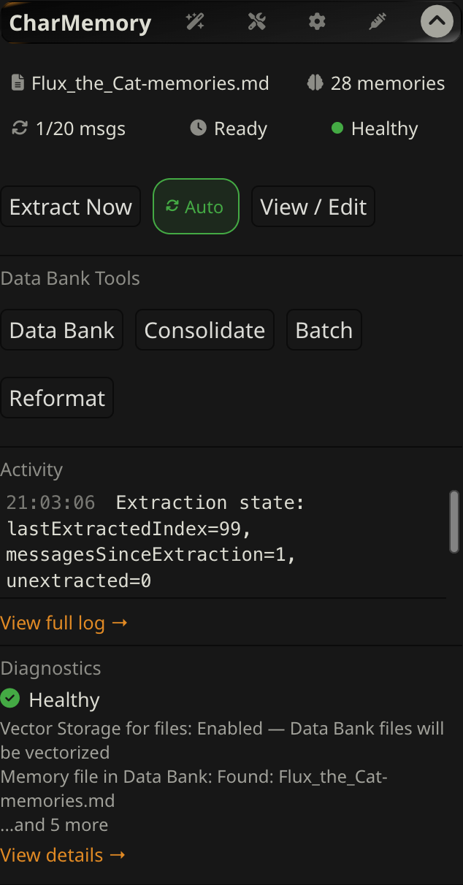
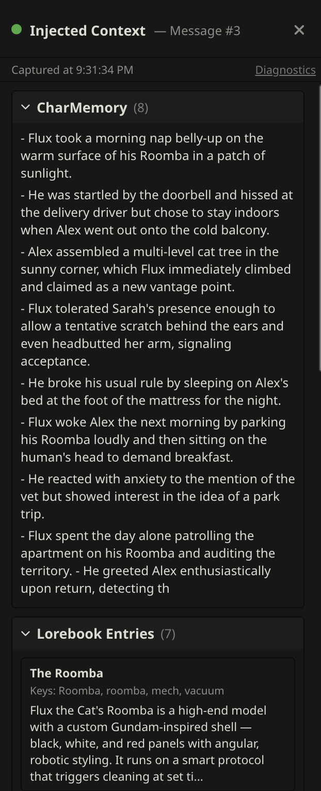
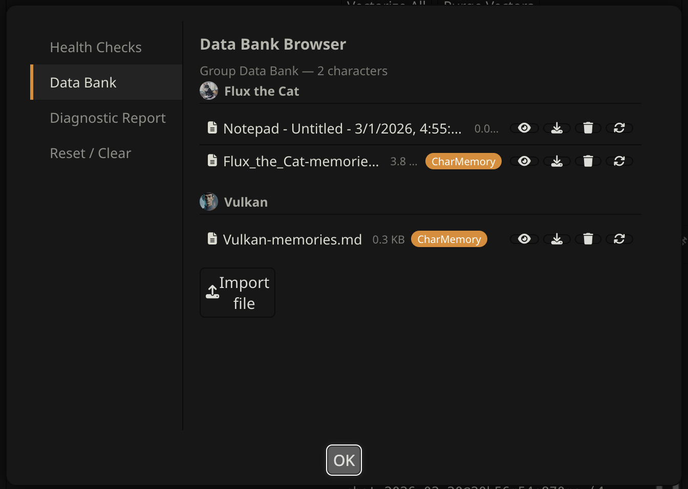

# CharMemory — SillyTavern Extension

CharMemory automatically extracts structured memories from your chats and stores them in the character's Data Bank. SillyTavern's built-in Vector Storage retrieves the most relevant ones at generation time — your character remembers what happened.

**This is a beta release. It contains extensive under the hood code changes, alters the extraction prompts and the structure of the extracted memories. If you used previous versions, you should plan to back up your current files.**



## Is this for you?

**CharMemory is built for setups where character cards define who a character is, and Data Bank character memories capture what happens to them over time.**

This is for you if:
- You use **character cards** and want characters to remember things across sessions
- You chat **1:1 or in group chats**
- You want memories stored as **plain, editable files** — not locked in a database

This probably isn't for you if:
- Your memory workflow is lorebook-based (World Info trigger entries)
- Your character cards are for multiple characters
- You don't use character cards

CharMemory and lorebook-based memory extensions can coexist — they use different storage mechanisms.

CharMemory does not touch your lorebooks so if those contain information about the character's world, they can supplement Data Bank memories. CharMemory does use its own structured markdown format for new Data Bank files. It will optionally process your existing files into the same format.

## Feature Highlights

- **Automatic extraction** — automatically extracts memories from your current chat. No manual steps after setup.
- **Group chat support** — each group member gets their own memory file, extracted in a single pass. View and edit all members' memories from one place, including a full Data Bank browser per character.
- **Injection Viewer** — a real-time sidebar showing exactly which memories were injected for any message, with scores and lorebook context.
- **Vector Storage health checks** — a traffic-light indicator flags misconfigured settings and tells you what to fix, so you're not guessing why memories aren't showing up.
- **Full memory control** — browse, edit, or delete individual memories. Consolidate duplicates with preview and undo. Batch-extract from all chats at once.
- **Highly configurable extraction prompts** — separate prompts for 1:1 and group chats and memory file consolidation and conversion.
- **Guided setup** — the Setup Wizard tests your LLM connection, checks Vector Storage, and handles existing memory file conversion in about 2 minutes.
- **Plain files** — memories are stored as readable, editable markdown in the character's Data Bank. No database, no lock-in.

## What you need

- A working **SillyTavern** installation
- An **LLM API key** (OpenRouter, Groq, DeepSeek, NanoGPT, etc.) — or use **Pollinations** (free, no key) or a **local server** (Ollama, LM Studio, etc.)
- **Vector Storage** — ships with SillyTavern, just needs to be enabled

## Install

**1.** Click the **Extensions** icon (puzzle piece) in SillyTavern's top bar

**2.** Click **Install extension** → paste this URL → **Install just for me**:
```
https://github.com/bal-spec/sillytavern-character-memory
```

**3.** Open a chat and scroll down in Extensions — **CharMemory** appears at the bottom. The Setup Wizard should open automatically on first run. If it does not, click the **wand icon** in the panel header to open the Setup Wizard.

**4.** The wizard walks you through connecting an LLM and checking Vector Storage. Takes about 2 minutes.

→ **[Getting Started](docs/getting-started.md)** has a step-by-step walkthrough of the wizard and your first extraction.

## Before you start

CharMemory stores memories as plain files in the character's Data Bank. Tools like **Consolidate**, **Replace All**, and **Clear All Memories** modify or delete these files and cannot always be undone. **Back up your Data Bank files** before making bulk changes — use SillyTavern's built-in [backup tools](https://docs.sillytavern.app/usage/user-settings/) or download individual files from the Data Bank.

## Documentation

| | |
|---|---|
| [Getting Started](docs/getting-started.md) | Setup Wizard, first extraction, verifying it works |
| [Injection Viewer](docs/injection-viewer.md) | See what memories are going into the prompt in real time |
| [Group Chats](docs/group-chats.md) | Multi-character extraction, Data Bank viewer for all members |
| [Managing Memories](docs/managing-memories.md) | View/Edit, Consolidate, Batch, Reformat, Data Bank tools |
| [Retrieval & Prompts](docs/retrieval-and-prompts.md) | Vector Storage setup, tuning, and prompt design for better recall |
| [Providers](docs/providers.md) | API keys, model recommendations, free options |
| [Troubleshooting](docs/troubleshooting.md) | Health checks, diagnostics, reset tools |
| [Architecture](docs/architecture.md) | Technical overview for developers and contributors |

## About the examples

The documentation uses **Flux** (an orange tabby cat) and **Alex** as fictional test characters. Flux was the real character used during CharMemory's development — their memories were the test corpus that shaped the tuning recommendations, retrieval settings, and prompt design described throughout the docs.

## What it looks like





