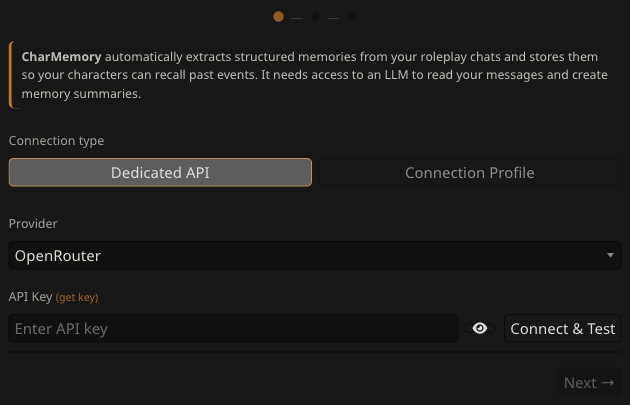
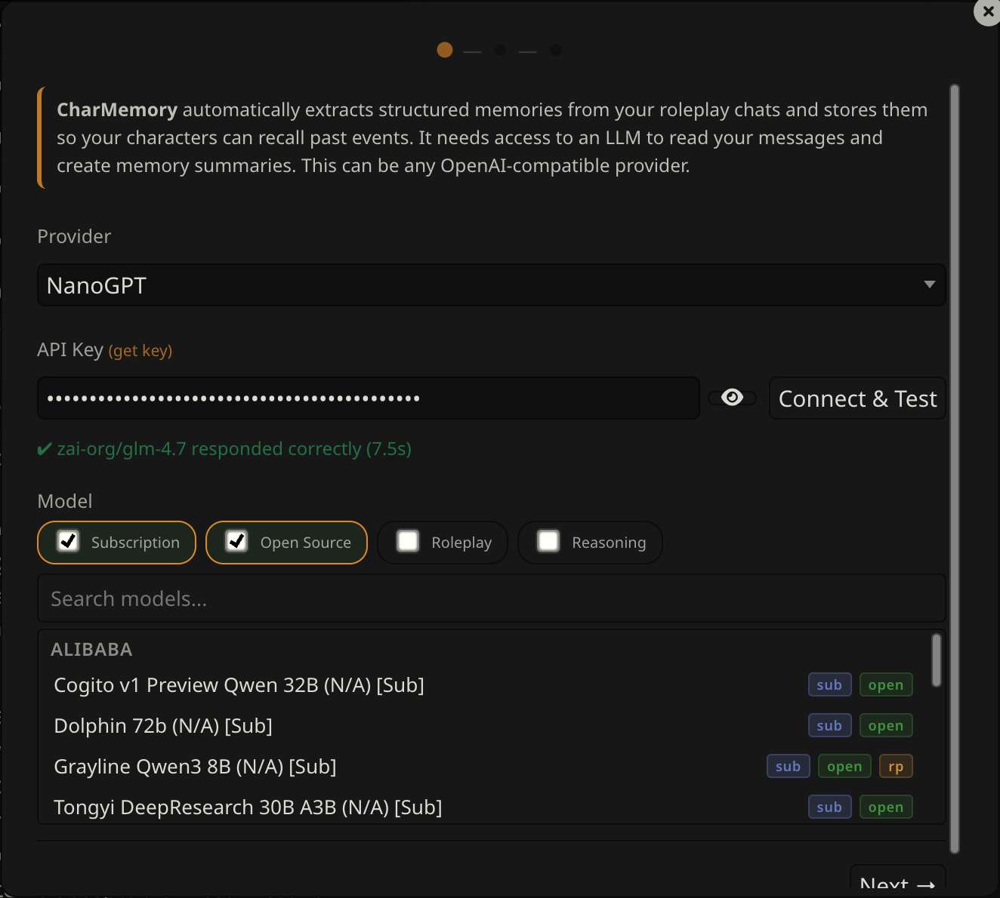
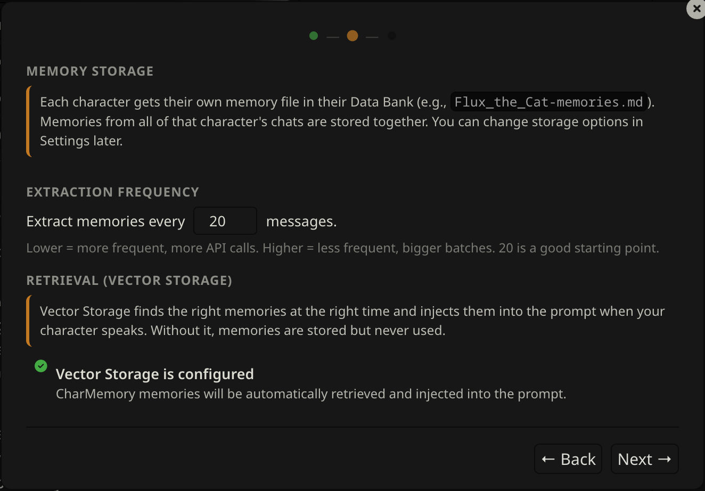
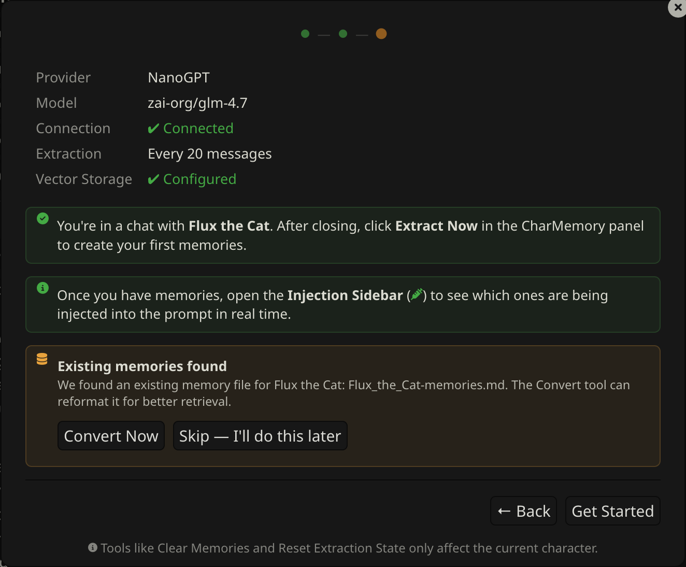
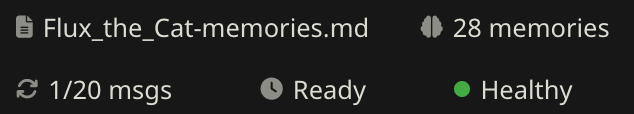

# Getting Started

After installing CharMemory, the **Setup Wizard** opens automatically on your first visit. It walks you through the two things you need before memories work: an LLM to extract them, and Vector Storage to retrieve them.

If the wizard didn't open automatically, click the **wand icon** (✦) in the CharMemory panel header at any time.

---

## Step 1: Connect an LLM

CharMemory needs its own LLM connection — separate from your main chat. This keeps the extraction prompt clean and uncontaminated by chat personas, jailbreaks, or system prompts.

**1. Choose a provider** from the dropdown, e.g. **NanoGPT**. If you're not sure, **Pollinations** is free and requires no API key. See [Providers](providers.md) for a full list with model recommendations.

**2. Enter your API key** if the provider requires one. Click the **(get key)** link for a direct link to that provider's key page.

**3. Click Connect.** CharMemory fetches the available models for that provider.

**4. Select a model.** Type to search — especially useful for providers with many models. Not sure which? **GLM 4.7** and **DeepSeek V3.1** are reliable extraction models.

**5. Click Test Connection** to confirm everything works. On success, the wizard enables the Next button.

> **Running an LLM locally?** Select **Local Server** from the provider dropdown. Enter your server URL (e.g., `http://localhost:11434/v1` for Ollama). No API key needed. See [Providers → Local Servers](providers.md#local-servers) for port numbers by backend.

> **If your provider is not listed** Many providers have an OpenAI compatible API endpoint. See if you can configure it that way.

---

## Step 2: Configure

### Extraction interval

Set how many character messages trigger an automatic extraction. The default is **20 messages** — a good starting point for most chat styles. Lower means more frequent extractions; higher means the LLM gets more context per call and tends to produce better, more selective memories.

### Vector Storage check

The wizard checks your Vector Storage extension configuration and shows one of three states:

**Green — Ready.** Vector Storage is enabled and settings look good. Nothing to do.

**Yellow — Needs tuning.** Vector Storage is active but you should examine some of the settings as they may reduce retrieval quality (e.g., chunk size too small, score threshold not set). The wizard shows specific recommendations but ultimately this is a trial and error process. You can continue and fix these later — see [Retrieval & Prompts](retrieval-and-prompts.md) for guidance.

**Red — Not enabled.** Vector Storage is installed but the "Enable for files" checkbox is off in the Vector Storage extension. Memories will be stored but your character won't recall them during chat.

> To fix the red state: open **Extensions → Vector Storage** → under **File vectorization settings**, check **Enable for files**. Then come back and click Re-check. New to Vector Storage? See SillyTavern's [Data Bank (RAG)](https://docs.sillytavern.app/usage/core-concepts/data-bank/) documentation for a full explanation.

The wizard won't block you — you can click Next even with warnings. But Vector Storage is what makes memories actually show up in conversation, so it's worth setting up before you start chatting.

---

## Step 3: Review & Go

The final step shows a summary of your configuration:

- **Provider and model** — what will run extraction
- **Connection** — whether the test passed
- **Extraction** — how often memories will be extracted
- **Vector Storage** — whether retrieval is ready

If anything looks wrong, click **Back** to fix it.

### Existing memories

If the current character already has a Data Bank memory file, the wizard offers to convert it to the current format (topic-tagged blocks for better retrieval). You can do this now or skip it — the same operation is available at any time via the **Reformat** button in the Data Bank Tools section. See [Managing Memories → Reformat](managing-memories.md#reformat) for details.

Click **Get Started** to close the wizard and return to the dashboard.

---

## Back up your data

SillyTavern has built-in backup tools that snapshot your entire data directory — characters, chats, settings, and Data Bank files (where memories live). Before making big changes like consolidating, clearing memories, or switching setups, it's worth having a recent backup.

See SillyTavern's [User Settings documentation](https://docs.sillytavern.app/usage/user-settings/) for how to create and manage backups.

---

## I'm set up — now what?

You've finished the wizard. Here's what to expect and how to get the most out of CharMemory.

### What happens automatically

**You don't need to do anything.** Just chat normally. CharMemory works in the background:

- Every 20 character messages (by default), it reads through the recent conversation, picks out the important things that happened, and saves them as bullet points in a file attached to the character.
- When the character generates their next message, SillyTavern's Vector Storage searches that file for memories relevant to what's being discussed and includes them in the prompt. The character has no idea this is happening — it just has extra context available.

You'll see a small counter in the CharMemory panel (e.g., `3/20 msgs`) tracking progress toward the next extraction. When it fires, a toast notification tells you how many memories were saved.

### Make sure Vector Storage is enabled

This is the one thing that can silently break everything. Without Vector Storage, CharMemory will extract and save memories just fine — but the character will never actually recall them. The memories sit in a file that nobody reads.

If you went through the Setup Wizard and it showed **green** for Vector Storage, you're good. If you skipped it, aren't sure, or see a **red health dot** in the CharMemory panel, here's the minimum setup:

1. Open the **Extensions** panel — click the **puzzle piece icon** (🧩) in SillyTavern's top bar
2. Scroll down in the extensions list and click **Vector Storage** to expand it — it's a built-in extension, not something you need to install
3. Scroll down within Vector Storage to the **File vectorization settings** section
4. Check **Enable for files** — this is the critical checkbox
5. For the embedding source, any option works. If you have an **OpenAI-compatible API key** (which you probably do if you set up CharMemory), select **OpenAI** and enter the key. If not, **Local (Transformers)** works without any API key — it downloads a small model to your machine

That's the minimum. The defaults for everything else are fine to start with. If you want to tune retrieval quality later, see [Retrieval & Prompts](retrieval-and-prompts.md).

> **How do I know it's working?** After your first extraction, generate a couple more messages and check the **health dot** in the CharMemory panel. Green means memories are being retrieved and injected. You can also click the **syringe icon** (Injection Viewer) to see exactly which memories the character can see.

### Will the character remember things in a new chat?

**Yes — that's the whole point.** Memories are attached to the character, not to a specific chat. If you chat with a character across multiple conversations, they build up a memory file over time. Start a fresh chat and bring up something that happened before — the character should be able to reference it.

It's not perfect recall. Vector Storage retrieves the memories most *relevant* to the current conversation. If you're talking about the beach trip from last week, memories about that trip will surface. Memories about an unrelated cooking lesson probably won't — unless something connects them. This is by design: dumping every memory into every prompt would waste your context window.

### What does "relevant" mean?

Vector Storage converts text into numerical representations (called "embeddings") that capture meaning. When the character is about to respond, it compares the current conversation against all stored memories and picks the closest matches — even if they don't share exact words. "We went swimming at the coast" would match memories about "the beach trip" because the *meaning* is similar.

This is why Vector Storage settings matter. If retrieval is too strict (high score threshold), few memories come back. Too loose, and irrelevant ones crowd out the important ones. The [Retrieval & Prompts](retrieval-and-prompts.md) guide covers tuning, but the defaults work for most setups.

### Tips for getting good results

- **Let it build up.** A single extraction from 20 messages produces a handful of memories. After a few hundred messages you'll have a rich memory file and retrieval becomes much more useful.
- **Check what's being injected.** Click the **syringe icon** (Injection Viewer) to see exactly which memories the character has access to for the current message. This is the fastest way to understand whether retrieval is working. See [Injection Viewer](injection-viewer.md).
- **Watch the health dot.** The colored dot in the stats bar tells you at a glance whether memories are being injected. Green = working. Yellow = something could be better. Red = memories aren't getting through. Click it for details.
- **Edit memories if they're wrong.** Click **View / Edit** to open the Memory Manager. Memories are just bullet points — delete bad ones, fix inaccurate ones, add things the LLM missed. The character will use whatever's in the file.
- **Don't over-extract.** More memories isn't always better. If the file gets very large with repetitive content, use **Consolidate** to merge duplicates and trim noise.

### The buttons in the panel — quick reference

| Button | What it does |
|--------|-------------|
| **Extract Now** | Run extraction immediately on all unprocessed messages (don't wait for the counter) |
| **View / Edit** | Open the Memory Manager to read, edit, or delete individual memories |
| **Consolidate** | Ask the LLM to merge duplicate/redundant memories and tighten the file |
| **Batch** | Extract memories from ALL of this character's chats at once (useful for existing characters) |
| **Reformat** | Convert an existing memory file to CharMemory's structured format |
| **Data Bank** | Browse and edit the raw memory file(s) in the character's Data Bank |

You don't need most of these day-to-day. **Extract Now** and **View / Edit** are the ones you'll use most.

---

## Your first extraction

After setup, chat normally. The **stats bar** at the top of the CharMemory panel tracks your progress:

| Item | What it shows |
|------|---------------|
| **File** | Memory file name for this character (e.g., `Flux-memories.md`) |
| **Memories** | Total memory bullets stored |
| **Progress** | Messages since last extraction vs. the threshold (e.g., `3/20 msgs`) |
| **Status** | `Ready` when extraction can fire, or a countdown timer during cooldown |
| **Health dot** | Green = injection healthy / Yellow = warnings / Red = problems. Click for details. |

When the counter reaches the threshold, extraction fires automatically. You can also trigger it manually at any time:

- **Extract Now** (button in the panel) — processes all unprocessed messages immediately
- **Extract Here** (brain icon on any character message) — processes messages up to that specific point

Extraction speed will vary based on the number of messages being sent to the LLM and its processing time. A toast notification provides status updates and how many memories were saved. You can watch the steps in the **Activity** section of the dashboard, or click **View full log** for the detailed log.

---

## Viewing your memories

There are a few ways to view your memories — you can open the Data Bank directly and read the raw file, or use the Memory Manager for a more structured view. Click **View / Edit** in the CharMemory panel to open the Memory Manager.

Memories appear as cards grouped by extraction, newest first. Each card shows the extraction timestamp and the individual memory bullets. Click the **pencil icon** on any card to enter edit mode — bullets become editable text fields where you can modify, delete, or add new memories. The editor includes **find/replace**, **undo**, and explicit **Save/Cancel** buttons so nothing is written to disk until you confirm. In group chats, a **character picker** lets you switch between members.

Memories are stored as a plain markdown file in the character's Data Bank. You can also edit that file directly from the **Data Bank** button in the panel. See [Managing Memories](managing-memories.md) for the full editing reference.

---

## Verifying memories are being injected

After your first extraction, generate a few more messages. Then click the **health dot** in the stats bar — if it's green, memories are being retrieved and injected correctly.

For a deeper look, open the **Injection Viewer** (syringe icon in the panel header) to see exactly which memories were injected for the latest message. See [Injection Viewer](injection-viewer.md) for how to read it.

If the health dot is yellow or red, see [Troubleshooting](troubleshooting.md).

> There are many ways for memories to either not be extracted well or not injected well. Much of this is down to extraction prompts, chunking and Vector Storage settings. It is impossible to provide out of the box functionality that will work for everyone, so you may need to spend some time adjusting to suit your particular chats and characters.

---

## Recommended next steps

| I want to… | Go to |
|-----------|-------|
| Understand what's being injected into the prompt | [Injection Viewer](injection-viewer.md) |
| Use CharMemory in a group chat | [Group Chats](group-chats.md) |
| Tune extraction frequency | [Managing Memories](managing-memories.md) |
| Change LLM provider or model | [Providers](providers.md) |
| Fix "memories stored but not recalled" | [Retrieval & Prompts](retrieval-and-prompts.md) |
| Something isn't working | [Troubleshooting](troubleshooting.md) |
