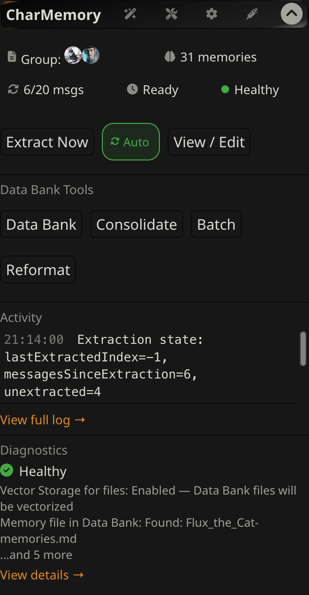
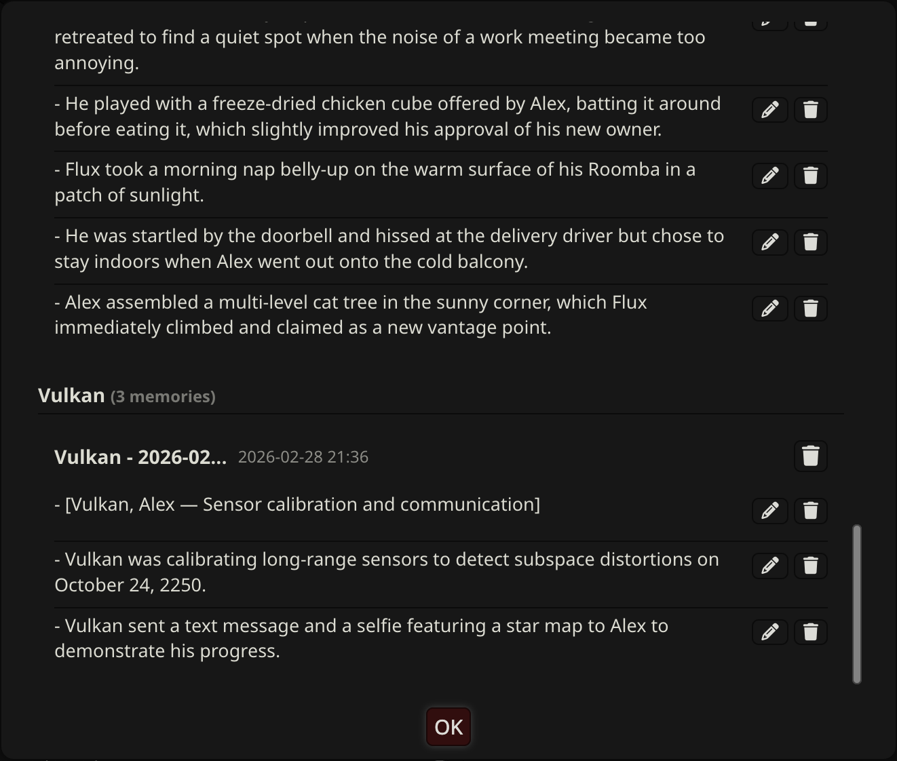

# Group Chats

CharMemory works in group chats with no extra setup. Each group member gets their own memory file, extraction handles all members in a single pass, and the Data Bank browser lets you view and manage every member's memories from one place.

---

## How extraction works

When extraction fires in a group chat — automatically or via **Extract Now** — CharMemory processes each chunk of messages once per group member. For each member it:

1. Reads that character's existing memories
2. Builds an extraction prompt with the character card and a participant list so the LLM knows who is speaking
3. Sends the chunk to the LLM
4. Appends any new memories to that character's file

Progress shows which character is being processed (e.g., "Flux (2/3)"). If the LLM call fails for one member, extraction continues with the remaining members — one failure won't abort the whole group.

The group chat uses a **separate extraction prompt** from 1:1 chats. It follows the same principles but adds a `{{participants}}` list and instructs the LLM to attribute memories to specific characters by name. You can customize it independently — changes to the 1:1 prompt aren't inherited by the group prompt, and vice versa.

---

## Viewing and editing group memories

Click **View / Edit** to open the Memory Manager. In a group chat it shows a section per character, each with their own memory cards. Edit and delete controls work the same as in 1:1 — they target the correct character's file based on which section the control is in.

Newest memory blocks appear first (reverse chronological) within each character's section.

---

## Data Bank browser

Click **Data Bank** in the panel to browse and manage memory files for all group members at once. Each member's file is listed with its memory count. You can view, edit, or delete files for any member without switching characters.

This is particularly useful for group chats because SillyTavern doesn't provide a built-in way to open the Data Bank for characters other than the active one — the CharMemory browser fills that gap.

---

## Consolidation

The **Consolidate** button in a group chat shows a character picker — select which member's memories to consolidate. Consolidation works on one character at a time to keep the preview manageable. Undo restores that character's previous file.

---

## Pin Memory

The bookmark icon on a group message routes the pinned memory to the correct character's file based on the message sender. If the sender can't be matched to a group member (e.g., a narrator message), it goes to the first member.

---

## Reset and Clear

Both options are available in **Settings** (gear icon → Reset / Clear) and in the **Troubleshooter** (wrench icon).

**Reset Extraction State** in a group chat resets the extraction pointer for all group members simultaneously. This is because SillyTavern stores `lastExtractedIndex` in the group's shared chat metadata — not per character.

**Clear All Memories** deletes memory files for all group members in the current group.

---

## How retrieval works in group chats

During generation, SillyTavern sets the active character to whichever group member is about to speak. Vector Storage retrieves memories from that character's Data Bank and injects them into the prompt. Each character gets their own memories when it's their turn — Flux gets Flux's memories, Alex gets Alex's. This is why it is necessary to have a specific extraction prompt for group chats.

**Re-vectorization caveat**: If you edit a character's memory file, you need to re-vectorize it to update the search index. SillyTavern's Vector Storage re-vectorizes on the *active* character — so you need to switch to each group member individually to trigger re-vectorization for their file. See [Retrieval & Prompts → Purge and re-vectorize](retrieval-and-prompts.md#purge-and-re-vectorize) for the steps.

**Diagnostics caveat**: After generation finishes, SillyTavern resets the active character. If you open Diagnostics between generations, the "Injected Memories" section may appear empty — there's no character context at that moment. This doesn't mean memories weren't injected, just that the snapshot was taken outside a generation turn. Use the [Injection Viewer](injection-viewer.md) on a specific message instead.
