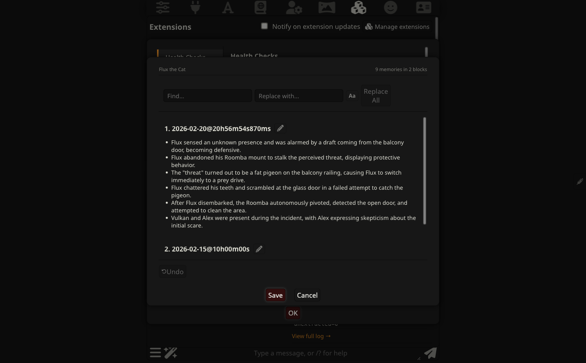
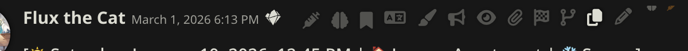
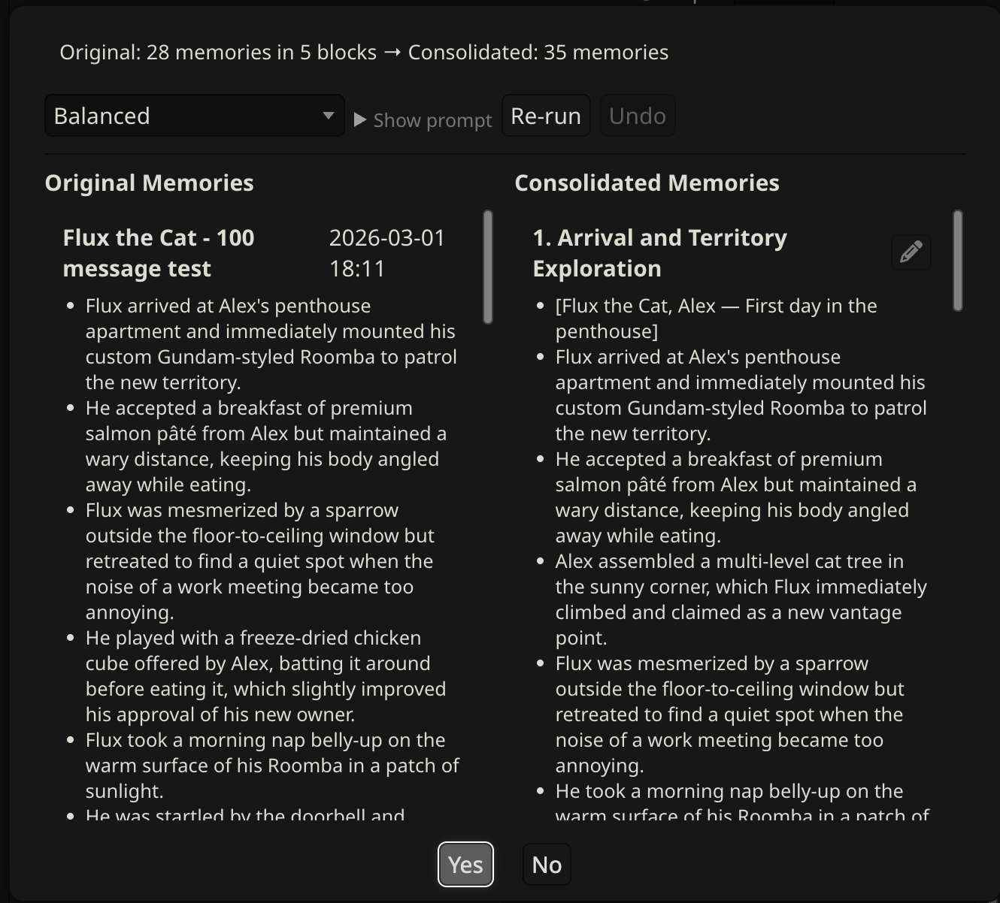
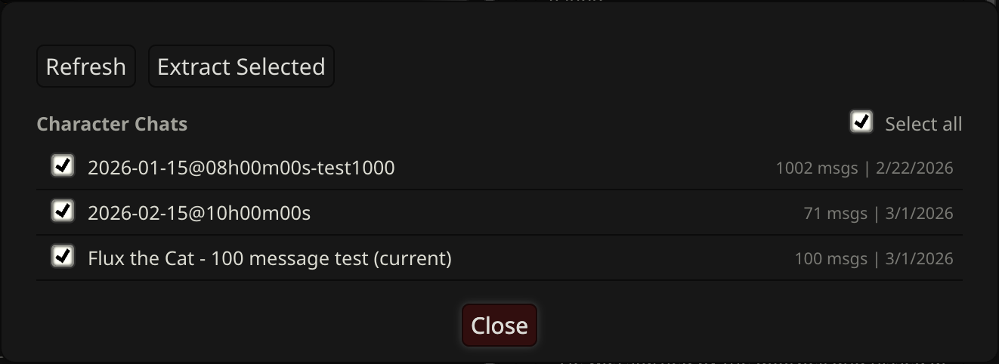

# Managing Memories

This doc covers the tools for working with memories after they've been extracted: browsing and editing individual bullets, consolidating duplicates, batch-extracting from old chats, reformatting for better retrieval, and clearing or resetting when you need a fresh start.

---

## View / Edit

Click **View / Edit** in the CharMemory panel to open the Memory Manager.

Memories appear as cards grouped by extraction, newest first. Each card shows the chat it came from, the extraction timestamp, and the individual memory bullets. You can:

- **Edit** any bullet — click the pencil icon, modify the text, save
- **Delete** any bullet — click the trash icon. Empty cards are removed automatically.
- **Add a bullet** — click the + button at the bottom of a card

Changes write directly to the memory file in the character's Data Bank. After editing, Vector Storage's index is stale — [purge and re-vectorize](retrieval-and-prompts.md#purge-and-re-vectorize) to update it, or send a new chat message.

### Find & Replace

A find/replace bar appears at the top of the Memory Manager (and in the Consolidation, Conversion, Reformat, and Data Bank editor dialogs). Type in the **Find** field to see matches highlighted across all cards with a live count. Enter replacement text and click **Replace All** to update every occurrence at once.

- **Case sensitive** — click the **Aa** button to toggle case-sensitive matching
- In the Memory Manager, Replace All writes changes to disk immediately — **back up your memory file first** if replacing across many memories
- In the Consolidation, Reformat, Conversion, and Data Bank editors, Replace All is undoable (click Undo to revert)

---

## Auto-extraction

CharMemory extracts automatically while you chat. The **Auto** pill in the panel header toggles this on or off. When on, two settings in **Settings → Extraction** control when it fires:

**Extract after every N messages** (default: 20) — how many character messages must arrive before extraction triggers. Higher values give the LLM more context per call and tend to produce better, more selective memories. Lower values extract more frequently with less context.

**Minimum wait between extractions** (default: 10 min) — a cooldown that prevents rapid-fire extractions during fast-paced chats. If the message threshold is reached but the cooldown hasn't expired, extraction is skipped and rechecked on each subsequent message. Messages keep accumulating during the cooldown, so when extraction finally fires it processes everything that built up.

Both settings only affect automatic extraction. Extract Now, Extract Here, and Batch always run immediately regardless of interval or cooldown.

---

## Extract Now and Extract Here

**Extract Now** (button in the panel) processes all unprocessed messages in the current chat immediately, without waiting for the auto-extraction threshold.

**Extract Here** (brain icon on any character message) processes all unprocessed messages up to and including that specific message. Useful for targeting a particular point in a conversation without processing everything after it.

Both use the same provider and settings as auto-extraction. You can watch progress in the **Activity** section of the dashboard or click **View full log** for the detailed log.

> **"No unprocessed messages"**: If Extract Now reports nothing to process, all messages have already been extracted. Use **Reset Extraction State** (see [Reset and Clear](#reset-and-clear) below) to re-read from the beginning.

---

## Extraction prompt

The extraction prompt is customizable in **Settings → Prompts**. Separate prompts exist for 1:1 chats, group chats, consolidation, and conversion — changes to one don't affect the others. **Restore Default** reverts any prompt to its original.

Each prompt type has its own template variables that get substituted before the prompt is sent to the LLM:

| Prompt | Available variables |
|--------|-------------------|
| **1:1 extraction** | `{{charName}}`, `{{charCard}}`, `{{existingMemories}}`, `{{recentMessages}}` |
| **Group extraction** | `{{charName}}`, `{{charCard}}`, `{{existingMemories}}`, `{{recentMessages}}`, `{{participants}}` |
| **Consolidation** | `{{charName}}` |
| **Conversion** | `{{charName}}`, `{{sourceText}}`, `{{today}}` |

`{{charCard}}` injects the character card as a bounded "baseline knowledge — do NOT extract" section. This prevents the LLM from repeatedly re-extracting traits already defined in the card (e.g., extracting "she works as a doctor" every chat when that's already in the card). Removing `{{charCard}}` from the prompt is a valid option — for example if the card is very large and consuming too many tokens — but expect more card-trait leakage in extracted memories.

For a detailed walkthrough of the prompt design decisions and how they affect retrieval quality, see [Retrieval & Prompts → The extraction prompt](retrieval-and-prompts.md#the-extraction-prompt).

---

## Pin as Memory

The **bookmark icon** on any message manually saves it as a memory with no LLM involved. An edit dialog opens pre-filled with the message text — rewrite it however you want before saving. Each line becomes a memory bullet.

Use this when you want to remember something specific and phrased exactly your way, without waiting for the next auto-extraction.

In group chats, the pinned memory goes to the correct character's file based on the message sender.

---

## Consolidate

When the memory file grows large, related or duplicate memories accumulate across different sessions. **Consolidate** sends the full memory file to the LLM to deduplicate and merge related entries. It always requires manual review — consolidation never runs automatically.

### Strategies

Choose a strategy before consolidating:

| Strategy | What it does |
|----------|-------------|
| **Conservative** | Merges near-exact duplicates only. Preserves the most detail. |
| **Balanced** | Merges duplicates and combines closely related facts. Good default. |
| **Aggressive** | Compresses heavily, summarizes by theme. Best for very large files that need significant reduction. |

Each strategy has its own prompt, fully visible and editable. **Restore Default** reverts to the original.

### Workflow

1. Choose a strategy and click **Consolidate**
2. Results appear as editable cards organized by theme
3. Edit, delete, or add bullets before applying — click the pencil icon on any card to enter edit mode
4. Not happy with the result? Click **Re-run** for a fresh attempt. Each re-run saves the previous version — click **Undo** to step back through prior versions.
5. Click **Apply** to write consolidated memories to the file

> **Undo only works before Apply.** Once you click Apply, the consolidated memories are written to the file and there is no undo. Back up the memory file first if you're consolidating a large or important set — open the Data Bank and download the file, or use SillyTavern's [backup tools](https://docs.sillytavern.app/usage/user-settings/) before proceeding.

In group chats, a character picker appears — consolidation works on one character at a time.

---

## Batch Extraction

Batch extraction processes multiple existing chats for the current character at once, without opening each chat individually.

1. Click **Batch** in the Data Bank Tools section
2. Click **Refresh** to load the list of chats for the current character
3. Check the chats you want to process (or **Select All**)
4. Click **Extract Selected** — a confirmation shows the total message count
5. Progress updates show which chat is being processed

Each chat's extraction state is tracked independently. Re-running batch extraction only processes new messages since the last run.

**For long existing chats**: Batch extraction works best for catching up on recent chats. For very long chats (hundreds of turns), early chunks have no existing memories for context, so the LLM may extract more sparsely than it would when extracting incrementally as you chat. If results are too sparse, try increasing **Messages per LLM call** (default: 50) in Settings to give the LLM a bigger window per chunk.

---

## Reformat

**Reformat** restructures your existing memory file to the current topic-tagged format for better vector retrieval. Use it when:

- You have older memories without topic tags (`[Names — description]` as the first bullet)
- You've imported memories from another source and want them normalized
- The Setup Wizard offered to convert existing memories and you skipped it

Click **Reformat** in the Data Bank Tools section. A preview dialog shows the before and after — review it, make any edits, then confirm to write the changes.

After reformatting, [purge and re-vectorize](retrieval-and-prompts.md#purge-and-re-vectorize) so the vector index reflects the new format.

---

## Data Bank

Click **Data Bank** to browse and manage memory files directly. You can view the raw markdown, edit it, and save changes. The editor includes find/replace and an **Undo** button — nothing is written to disk until you click **Save changes**. This is the same file that Vector Storage indexes — useful for bulk edits or importing content from another tool.

In group chats, the browser shows files for all group members, not just the active character. See [Group Chats → Data Bank browser](group-chats.md#data-bank-browser) for details.

---

## Per-chat memories

By default, all chats for a character share one memory file. Enable **Separate memories per chat** in Settings → Storage to give each conversation its own file. This is useful when the same character appears in different scenarios or timelines that shouldn't share context.

Per-chat mode also works in group chats — each member gets a separate per-chat memory file.

> **Known limitation**: Batch extraction with per-chat mode active has a bug — extracted memories from non-active chats may go to the wrong file. Use batch extraction with the default (shared) mode.

---

## Reset and Clear

Three options in Settings → Reset / Clear:

**Reset Extraction State** — resets the extraction pointer for the current chat. Next time you run Extract Now, it re-reads all messages from the beginning. Does not delete any memories. In group chats, all members share one extraction pointer so this resets all of them at once.

**Reset Batch Progress** — clears the Batch tool's record of which messages it has processed across all of this character's chats. Use this when you want the Batch tool to re-process everything from scratch (e.g., after changing the extraction prompt). Does not affect Extract Now or auto-extraction. If you reset batch progress without also clearing memories, the next batch run will re-extract everything and may create duplicates.

**Clear All Memories** — deletes the character's memory file and resets all extraction tracking. In default (shared) mode, this file contains memories from **all** of that character's chats — not just the current one. Cannot be undone. **Back up first** — use SillyTavern's [backup tools](https://docs.sillytavern.app/usage/user-settings/) or download the memory file from the Data Bank before clearing.

---

## Slash commands

| Command | Description |
|---------|-------------|
| `/extract-memories` | Force extraction regardless of interval or cooldown |
| `/consolidate-memories` | Run consolidation with the current strategy |
| `/charmemory-debug` | Capture diagnostics and dump to console |
