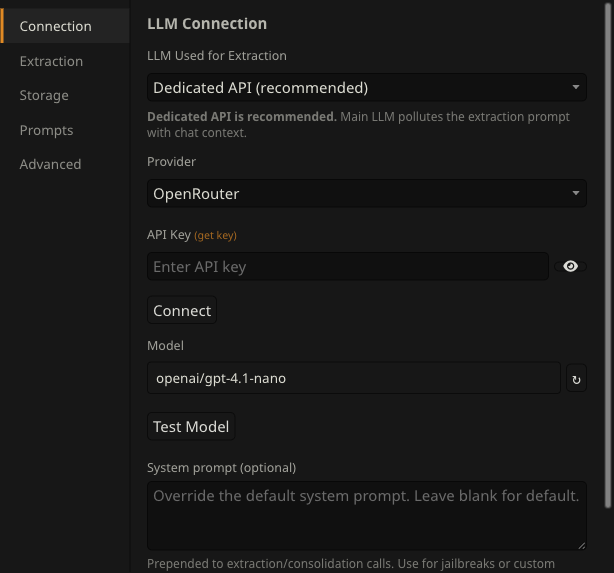
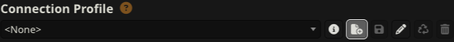
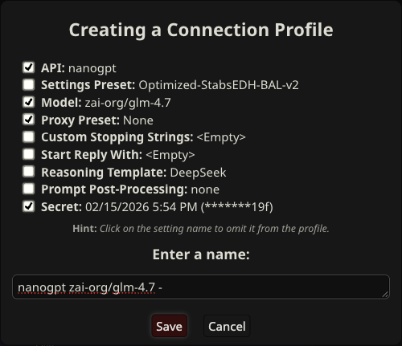
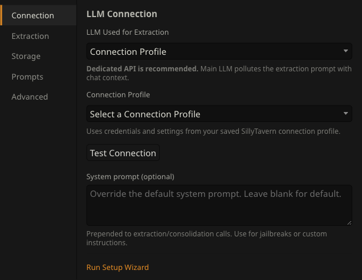

# Providers

CharMemory works better when it uses its own LLM connection — separate from your main chat LLM. This keeps the extraction prompt clean: no chat personas, jailbreaks, or system prompts get mixed in, which produces noticeably better memories.

---

## Extraction sources

Four options for **LLM Used for Extraction** in Settings → Connection:

| Source | How it works | Best for |
|--------|-------------|----------|
| **Dedicated API** (default) | Direct API call with only the extraction prompt | Best quality — recommended |
| **Connection Profile** | Reuses a saved SillyTavern connection profile | Already have a profile configured in ST |
| **WebLLM** | Small model running locally in your browser | Privacy and no API cost; limited quality |
| **Main LLM** | Uses whatever LLM your chat is using | Not recommended; No extra setup but quality suffers |

**Dedicated API** is the default and recommended option. The extraction prompt is the only thing sent — the character card is included as bounded reference context (so the LLM knows what *not* to re-extract), but no chat system prompts, personas, or jailbreaks contaminate the call.

---

## Dedicated API providers

Open Settings → Connection → choose a **Provider**:

| Provider | Auth | Notes |
|----------|------|-------|
| **Anthropic** | API key | Uses the Messages API (not OpenAI-compatible) |
| **DeepSeek** | API key | Strong instruction following at low cost |
| **Groq** | API key | Fast inference, limited model selection |
| **Mistral** | API key | Good quality, European-based |
| **NanoGPT** | API key | Subscription and open-source model options; see [NanoGPT](#nanogpt) below |
| **NVIDIA** | API key | Routes through SillyTavern server (CORS); see [NVIDIA](#nvidia) below |
| **Ollama** | None | Local; see [Local Servers](#local-servers) |
| **OpenAI** | API key | Reliable, standard `/models` endpoint |
| **OpenRouter** | API key | Access to many models under one key |
| **Pollinations** | None | Free, no account needed; see [Pollinations](#pollinations) below |
| **xAI (Grok)** | API key | Grok models |
| **Custom** | Optional | Any OpenAI-compatible endpoint |

### Setup steps

1. Select a provider
2. Enter your **API key** (click the **(get key)** link for a direct link to that provider's key page)
3. Click **Connect** to fetch available models
4. Search and select a **model**
5. Click **Test Connection** to confirm it responds correctly

---

## Connection Profiles

If you already have a connection configured in SillyTavern's **Connection Manager**, you can reuse it for extraction instead of setting up a separate Dedicated API connection.

### What is a Connection Profile?

A Connection Profile is a SillyTavern feature that saves a snapshot of your current API connection settings — so you can switch between configurations quickly. A profile can include any combination of:

| Setting | Description |
|---------|-------------|
| **API** | Which API provider (e.g., NanoGPT, OpenAI, OpenRouter) |
| **Settings Preset** | The sampler/generation preset |
| **Model** | The specific model to use |
| **Proxy Preset** | Proxy configuration (if any) |
| **Custom Stopping Strings** | Custom stop sequences |
| **Start Reply With** | Prefill text for responses |
| **Reasoning Template** | Reasoning/thinking format (e.g., DeepSeek) |
| **Prompt Post-Processing** | Any prompt post-processing rules |
| **Secret** | Your API key (stored securely) |

Each setting has a checkbox — you choose which parts to include. When a profile is loaded, only the checked settings are applied.

### Creating a profile in SillyTavern

1. Open the **API Connections** panel (plug icon in SillyTavern's top bar)
2. Configure your API: select a **Chat Completion Source**, enter your **API key**, select a **model**, and verify the connection shows **Valid**
3. Click the **create icon** (file with plus) in the Connection Profile toolbar
4. Check the settings you want to include in the profile — at minimum, check **API**, **Model**, and **Secret**
5. Give it a name and click **Save**

### Using a profile for CharMemory extraction

1. In the CharMemory panel, click the **gear icon** to open Settings
2. Under **Connection**, change **LLM Used for Extraction** to **Connection Profile**
3. Choose your profile from the **Connection Profile** dropdown
4. Click **Test Connection** to verify it works for extraction
5. Optionally set a **System prompt** override — if left blank, CharMemory uses its default extraction system prompt

Connection Profiles use whatever credentials, model, and endpoint are configured in the profile. You don't need to enter an API key or select a model separately — it's all inherited from the profile.

> **When to use this vs. Dedicated API:** If you've already configured a connection in SillyTavern and want to reuse it without duplicating API keys, Connection Profile is convenient. If you want a completely separate LLM for extraction (different model, different provider), Dedicated API gives you full control.

---

## Recommended models

Memory extraction requires strong instruction following — the LLM must respect the extraction rules, stay within boundaries, and produce well-formatted output.

| Model | Notes |
|-------|-------|
| **GLM 4.7** | Best quality and speed. Highly recommended. On NVIDIA, uses reasoning tokens — set Max response length to 2000–3000. On NanoGPT, works at default settings. |
| **DeepSeek V3.1 / V3.2** | Solid instruction following, good second choice. |
| **Mistral Large 3** | Good quality, sometimes verbose. |
| **GPT-4.1 nano / mini** | Reliable at low cost. |
| **Llama 3.1 8B Instruct** | Fast and cheap, works well for testing. |

**Avoid:**
- **Qwen3-235B** — tends toward compressed play-by-play even with the current prompt
- **Very small models** — may reverse who did what or blur existing/new memory boundaries
- **Heavily censored models** — may refuse to extract from mature content, returning nothing

### Reasoning / thinking models

Some models spend part of their token budget on internal reasoning before producing output (e.g., GLM-4.7 on NVIDIA). CharMemory handles this transparently — it reads the reasoning output when the content field is empty. However, you need to increase **Max response length** to 2000–3000 to give the model enough budget for both reasoning and actual memory output. If you see "0 memories" with a thinking model, this is almost always the fix.

The Activity Log shows `[reasoning: N chars]` when a model uses reasoning tokens, so you can see at a glance how much of the budget is going to reasoning vs. output.

---

## Local servers

Select **Local Server** from the provider dropdown, then adjust the **Base URL** to match your backend:

| Backend | Default URL |
|---------|-------------|
| **Ollama** | `http://localhost:11434/v1` |
| **LM Studio** | `http://localhost:1234/v1` |
| **llama.cpp** | `http://localhost:8080/v1` |
| **KoboldCpp** | `http://localhost:5001/v1` |

You can also use a LAN IP (e.g., `http://192.168.1.50:5001/v1`) if the server is on another machine. No API key needed. Click **Connect** to fetch models, select one, and test.

**Ollama CORS**: Ollama requires `OLLAMA_ORIGINS=*` to accept browser requests. Set this as an environment variable before starting Ollama.

---

## NanoGPT

NanoGPT provides access to a wide range of models including both subscription and open-source options. When NanoGPT is selected, filter checkboxes appear above the model list:

| Filter | Description |
|--------|-------------|
| **Subscription** | Models included in your NanoGPT plan |
| **Open Source** | Open-source models |
| **Roleplay** | Models suited for storytelling |
| **Reasoning** | Models with reasoning capability |

Multiple filters combine as intersection (all checked filters must match). Models are grouped by their upstream provider.

NanoGPT also works as a vectorization source in Vector Storage — the same API key covers both extraction and embedding.

---

## Pollinations

Pollinations is free and requires no account or API key — useful for trying CharMemory without signing up for anything. Select **Pollinations**, type a model name (e.g., `openai`), and click Connect.

Quality depends on which model Pollinations routes to, so it's best for testing and evaluation rather than long-term use.

---

## NVIDIA

NVIDIA's API doesn't support browser-to-API CORS requests. CharMemory automatically routes NVIDIA calls through SillyTavern's server — your API key is passed securely via headers and never touches SillyTavern's configuration. No extra setup needed.

---

## Custom

Select **Custom** to use any OpenAI-compatible endpoint. Enter the base URL (e.g., `https://my-server.com/v1`) and an API key if required. Works with any backend that supports the `/chat/completions` format.

---

## Per-provider settings

Each provider stores its own API key, model selection, system prompt, and (for Custom) base URL independently. Switching providers preserves your settings for each — you can switch between providers without re-entering keys or re-selecting models.

The **System prompt** field lets you customize the system message sent to the extraction LLM. Useful for models that respond better to specific framing or instruction styles.
