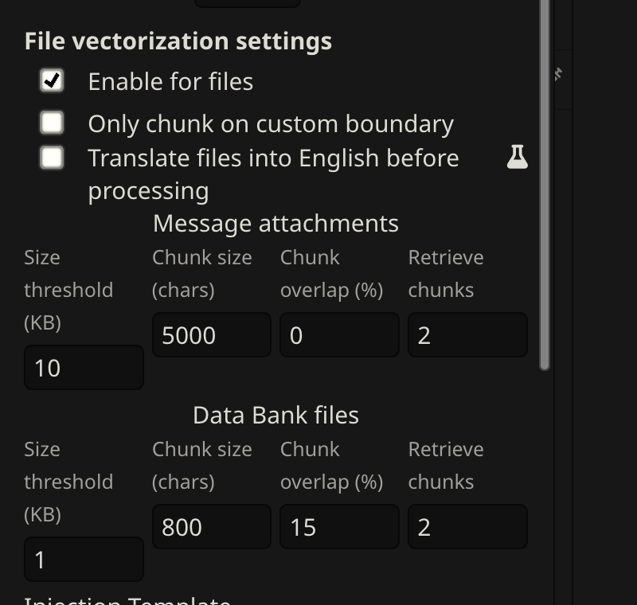

# Retrieval & Prompts

Retrieval quality depends on two things: **what the extraction prompt produces**, and **how Vector Storage is configured**. Most people start with Vector Storage settings — but the bigger lever is the prompt. A well-structured memory block retrieves accurately even with default settings. A poorly structured one won't retrieve well no matter how much you tune.

---

## How retrieval works

CharMemory extracts memories from your chat and stores them as markdown in the character's Data Bank. From there:

1. **Vector Storage chunks the file** — splits it into segments (configurable size, default ~1000 characters)
2. **Each chunk gets an embedding** — a numerical vector representing its meaning
3. **On each generation**, Vector Storage embeds the recent chat message, finds the most similar chunks, and injects them into the prompt

The character only "remembers" what Vector Storage retrieves. If a memory block doesn't match well against the current conversation, it won't be injected — even if it's relevant. This is why what the prompt produces matters as much as how Vector Storage is configured.

For a full explanation of SillyTavern's Data Bank and Vector Storage, see the official [Data Bank (RAG)](https://docs.sillytavern.app/usage/core-concepts/data-bank/) documentation.

---

## The extraction prompt

The extraction prompt is the single most impactful thing you can control for memory quality. It determines what gets stored and how it's structured — which directly determines what Vector Storage can retrieve later. The key insight behind CharMemory's prompt design: **the prompt determines the shape of the embedding.** Memory blocks that look good to a human reader may retrieve poorly under vector search if they lack distinctive tokens. Everything in the default prompt exists to produce memories that are both meaningful and retrievable.

The prompt is complex by design — it uses bounded reference sections, negative examples, layered constraints, and a litmus test for significance. This means **extraction quality depends heavily on a model with strong instruction following.** A capable model respects the card boundary, stays within the bullet limit, and writes outcome-oriented memories. A weaker model ignores the constraints and produces play-by-play, card-trait leakage, or duplicates of existing memories. See [Providers → Recommended models](providers.md#recommended-models) for tested options.

> **Cost awareness:** Every extraction is an LLM API call. Each call sends the extraction prompt, the character card, existing memories, and the recent chat messages — which can be a substantial number of tokens. With default settings (extract every 20 messages), steady-state costs are modest. But **usage is typically highest when you're getting started** — batch-extracting existing chats, running consolidation, re-extracting after prompt changes, and experimenting with settings all generate many more calls than normal chatting does. Group chats multiply this further (one call per character per chunk). If you're using a paid API provider, keep an eye on your usage dashboard during the setup and tuning phase. Once you're past initial setup and into regular chatting, costs settle to a predictable rhythm. See [Providers](providers.md) for free options like Pollinations and local servers.

The full prompt is visible and editable in **Settings → Prompts**. Below is a walkthrough of the design decisions — understanding them helps you make effective changes if the defaults don't fit your use case.

### Anatomy of the 1:1 prompt

The prompt has five functional sections:

**Bounded context.** The character card and existing memories are included as clearly delimited reference sections, bounded with `===== START / END =====` markers. Each section has explicit instructions: the card says "do NOT extract anything already described here," existing memories say "do NOT repeat, rephrase, or remix." Without the card boundary, the LLM re-extracts baseline traits every session — the most common extraction quality problem. Without existing memories as reference, it produces duplicates.

**Extraction rules.** Nine numbered instructions control the output format. The most consequential for retrieval:

- **Topic tag as the first bullet** — `[{{charName}}, OtherNames — short description]`. See [Topic tags](#topic-tags) below for why this is the single most important format decision.
- **One `<memory>` block per scene** — prevents splitting related events across blocks, which fragments the embedding and makes it harder for vector search to match the right context.
- **5-bullet limit per block** — forces outcome-oriented extraction. A 200–400 character block gets a focused embedding that represents one event well. A 1000-character block gets a diluted embedding that represents multiple events poorly. With more room, LLMs default to play-by-play narration.
- **Third person, past tense, character's name** — produces consistent text that embeds predictably. Pronouns like "she" carry no semantic signal for vector search; the character's actual name does.
- **"What happened" not "what was discussed"** — prevents meta-narration like "she told him about her past." The actual facts retrieve better than descriptions of conversations about facts.

**WHAT TO EXTRACT.** A guided list anchored by a litmus test: *"Would this character bring this up unprompted weeks or months later?"* This filters for lasting significance — backstory reveals, relationship changes, emotional turning points — rather than in-the-moment detail.

**DO NOT EXTRACT.** Explicit negative instructions targeting the most common extraction mistakes:
- **Card-trait leakage** — the LLM re-discovers what's already in the character card (e.g. if the card says "competitive", extracting "she felt proud when she won again")
- **Meta-narration** — writing about the conversation rather than the events ("she told him about X" instead of the actual fact X)
- **Play-by-play** — step-by-step scene recaps instead of outcomes
- **Temporary states** — things with no significance beyond the immediate moment

**Positive and negative examples.** A play-by-play example (labeled as bad) and a topic-tagged example (labeled as good) using Flux and Alex. Concrete examples are more effective than abstract rules for steering LLM output — the model pattern-matches against them.

### Topic tags

Each memory block starts with a topic tag as its first bullet: `[CharName, OtherNames — short description]`. This is the single most important factor in retrieval quality — more impactful than chunk size, overlap, or threshold tuning.

**Why they work:** When a character accumulates dozens of memory blocks, the blocks tend to share vocabulary and themes. Without distinctive identifiers, every block's embedding looks similar, and Vector Storage can't tell them apart. Topic tags front-load each block with unique anchors that the embedding model can latch onto:

- **The character's own name first** — embedding models weight early tokens heavily. The prompt requires `{{charName}}` first because without this explicit instruction, the LLM treats the POV character as implied and only lists other participants — losing a key discriminating signal.
- **Other participants by name** — "Sarah" is a unique token that creates a strong similarity signal when "Sarah" appears in the current chat. Generic labels like "a friend" or "someone" produce generic embeddings that match everything equally.
- **A short, specific descriptor** — "first vet visit and vaccinations" is distinctive; "important event" is not.

The difference is concrete: without topic tags, mentioning "the vet" in chat scores similarly against almost every memory block in the file. With them, it matches strongly against `[Flux, Alex — first vet visit and vaccinations]` and weakly against `[Flux, Alex — adoption day at the apartment]`, even though both blocks share vocabulary about Flux and Alex. This pattern held consistently during testing with a character (Flux — an orange tabby cat) whose ~50 memory blocks were all thematically similar. Tuning Vector Storage settings (embedding model, score threshold, chunk overlap) improved things incrementally, but topic tags were the step change.

If your older memory files don't have topic tags, use **Reformat** (Data Bank Tools section) to convert them. The improvement in retrieval precision is typically significant.

### What good extraction looks like

**Before (play-by-play — retrieves poorly):**
```
- Alex set the carrier down on the hardwood floor and opened the metal door.
- Flux emerged from the carrier and walked toward the Gundam Roomba by the window.
- Alex poured premium salmon pâté into a ceramic bowl and placed it near the kitchen island.
- Flux ate the salmon and began purring for the first time.
- Alex assembled a cat tree in the corner and Flux climbed to the top perch.
```

**After (topic-tagged, tight — retrieves well):**
```
- [Flux, Alex — adoption day and settling into the apartment]
- Alex adopted Flux and brought him to his penthouse apartment, where Flux immediately bonded with his custom Gundam-styled Roomba.
- Flux's first meal of premium salmon pâté triggered his first purr in the new home.
- Alex assembled a cat tree that Flux claimed as a second perch, alternating between it and the Roomba.
```

The topic tag anchors the embedding. The three bullets capture outcomes, not steps. When someone mentions "adoption" or "Roomba" in chat, this block scores high. The play-by-play version would score about the same as every other block in the file.

### Why the group prompt is different

Group chats need a separate extraction prompt because the context is fundamentally different. In a 1:1 chat, there's one character and one user — the LLM knows whose memories it's extracting. In a group chat, multiple characters are speaking, and extraction runs once per member on the same message chunk.

The group prompt mirrors the 1:1 structure but adds:

- **`{{participants}}` list** — the LLM needs to know who's in the group and who is speaking in each message, so it can attribute actions and dialogue correctly.
- **Explicit character targeting** — "Character whose memories you are extracting: {{charName}}" appears prominently. Without this, the LLM tends to extract memories for everyone rather than focusing on the target character.
- **Participant naming rule** — instruction 10 says "Reference other participants by name. Include who was involved in events, who said what to whom, who was present." In group chats, who did what to whom is the primary differentiator between memory blocks. Named participants in topic tags become even more critical because multiple characters may share similar events.
- **Group dynamics** — the WHAT TO EXTRACT list adds "who allied with whom, who disagreed, power shifts" — relationship signals that are unique to multi-character interactions.

Both prompts share the same format rules (topic tags, bullet limits, DO NOT EXTRACT list). Changes to one don't affect the other — they're independently editable in Settings → Prompts.

### Consolidation prompts

When you use **Consolidate** to merge duplicate or related memories, a different prompt handles the task. Three strategy presets are available, each with its own prompt:

- **Conservative** — merges near-exact duplicates only. Preserves the most detail. Use when you want minimal change.
- **Balanced** — merges near-duplicates and combines closely related facts, but preserves all unique information. Good for periodic cleanup.
- **Aggressive** — compresses heavily, groups by theme, and summarizes rather than listing individual events. Best for very large memory files that need significant reduction.

All three require the same format rules as extraction — topic tags as the first bullet with the character's name first, 5-bullet limit, named participants. The key difference is the instruction to *merge* rather than *extract*: the LLM is working with existing memories, combining related entries while preserving the format that makes them retrievable. When two blocks about the same event get merged, the prompt instructs the LLM to update the topic tag to reflect the combined content.

> Consolidation sends the entire memory file to the LLM in a single call. For characters with large memory files, this can be a significant number of tokens. Review the Activity Log after consolidating to see the token usage.

### Conversion prompt

The **Reformat** tool uses a conversion prompt to restructure existing memories into the topic-tagged format. This serves a different purpose from extraction — it's not pulling new information from chat, it's reorganizing text that already exists.

The conversion prompt has a strict "do NOT add, infer, or invent" rule because the input is existing memories, not raw chat. It handles three input types: unstructured text (plain notes), partially formatted blocks (some structure but no topic tags), and already-formatted blocks (which it leaves unchanged). This makes it safe to run on any memory file — well-formatted blocks pass through untouched while old-format blocks get upgraded.

All prompts are independently editable in **Settings → Prompts**. Changes to one don't affect the others.

### Adapting to your use case

The default prompts were designed and tested with a character whose memories were episodic (events happening over time) and thematically similar (many encounters with different people in similar settings). This is a common but not universal pattern. Depending on how you use characters and chats, you may need to adapt.

**Characters with highly varied content** — if your character's memories naturally span very different topics (magic spells vs. political intrigue vs. personal relationships), topic tags may be less critical because the vocabulary already differs across blocks. The default prompt still works, but you could relax the bullet limit if you find it too restrictive.

**Short, focused chats** — if each chat is a self-contained scenario rather than an ongoing story, you may want to lower the extraction interval so memories are captured before the chat ends. The default prompt's emphasis on long-term significance ("Would they bring this up months later?") may also be too selective — consider adjusting the WHAT TO EXTRACT litmus test in Settings → Prompts.

**Multiple timelines or scenarios for one character** — by default, all chats for a character share one memory file. This is ideal when chats are a continuous story — memories from Monday's chat inform Tuesday's. But if the same character appears in incompatible scenarios (a modern AU and a fantasy setting, or a "what if" branch), shared memories create cross-contamination. Enable **Separate memories per chat** in Settings → Storage to give each conversation its own isolated memory file with its own vector index. See [Managing Memories → Per-chat memories](managing-memories.md#per-chat-memories) for details and limitations.

**Persistent worlds with many NPCs** — names in topic tags become even more important. If your character interacts with dozens of named NPCs, the topic tags are doing the heavy lifting for disambiguation. You may also want to increase Retrieve chunks to inject more context per generation.

**Characters whose card changes frequently** — the DO NOT EXTRACT boundary relies on the character card being stable. If you update the card often, the LLM may not extract things that later get removed from the card. Consider extracting core traits as memories before major card rewrites.

**Non-English chats** — the default prompt is in English, and embedding models vary in multilingual quality. If your chats are in another language, test whether the embedding model you're using handles that language well. Topic tags in the chat's language (rather than English) may retrieve better.

The extraction prompt is fully editable — you can see and modify it in **Settings → Prompts**. Separate prompts exist for 1:1 chats, group chats, consolidation, and conversion. See [Managing Memories → Extraction prompt](managing-memories.md#extraction-prompt) for the template variables available in each prompt.

---

## Vector Storage setup

### The one setting that must be on

Open **Extensions → Vector Storage** → scroll to **File vectorization settings** → check **Enable for files**.



This is the most common reason memories aren't being recalled. Everything else is tuning — this is the on/off switch.

### Choosing an embedding source

The embedding model converts memories into numerical vectors. The quality of the model determines how well Vector Storage can distinguish relevant memories from irrelevant ones — a weak model makes every memory look vaguely similar, so retrieval becomes a grab-bag.

| Source | Quality | Speed | Cost |
|--------|---------|-------|------|
| **Local (Transformers)** | Adequate | Slow on first run | Free |
| **OpenAI** | Excellent | Fast | ~$0.01/1M tokens |
| **NanoGPT** | Excellent | Fast | Check current pricing |
| **Ollama** | Good–Excellent | Fast (local GPU) | Free |
| **Cohere / Jina / Voyage** | Good–Excellent | Fast | Free tier / cheap |

> Provider availability, model selection, and pricing change frequently. This list reflects what was available and tested at the time of writing — check your provider's current documentation for up-to-date details.

**Recommendations:**
- Getting started or privacy-focused: **Local (Transformers)** is fine. The default model (`all-MiniLM-L6-v2`) works but has lower discrimination than larger models.
- Best retrieval quality: **`text-embedding-3-small`** via OpenAI or NanoGPT. If you already use NanoGPT for extraction, the same API key works for embedding.
- Local with better quality: **`nomic-embed-text`** via Ollama.

> **Score thresholds vary by model.** A score of 0.3 on `text-embedding-3-small` means something different than 0.3 on `all-MiniLM-L6-v2`. If you switch embedding models, re-tune your score threshold and re-vectorize.

### Recommended settings

These apply to the **Data Bank files** row in Vector Storage (the bottom row — CharMemory uses Data Bank, not message attachments).

These settings were arrived at iteratively through testing with `text-embedding-3-small` and a character with ~50 memory blocks covering thematically similar content. Treat them as a starting point — your optimal values will depend on your embedding model, memory file size, and how distinctive your memories are.

| Setting | Starting value | Notes |
|---------|---------------|-------|
| **Size threshold** | 1 KB | Files below this get a single embedding. At 1 KB, chunking kicks in so specific memories can be retrieved. |
| **Chunk size** | 1000 chars | Each chunk gets its own embedding. At ~200–400 chars per memory block, 1000 fits 2–3 blocks — enough for clean retrieval without mixing unrelated topics. |
| **Chunk overlap** | 0% | Copies the end of each chunk into the start of the next. With small topic-tagged blocks, 0% works well as a starting point. Increase to 10–15% if you see blocks getting split (check the [Injection Viewer](injection-viewer.md)). |
| **Retrieve chunks** | 2 | Chunks injected per generation. At 2–3 blocks per chunk, this gives ~4–6 memory blocks — enough context without flooding the prompt. |
| **Score threshold** | 0.3 | Filters out low-relevance chunks. Without this, Vector Storage injects its top N regardless of relevance. Start at 0.3; lower to 0.2 if too few memories inject, raise to 0.4 if irrelevant ones appear. |
| **Query messages** | 1 | Recent messages used as the search query. 1 keeps retrieval focused on the current topic. |

These are starting points. See [Tuning](#tuning) below for how to iterate.

---

## Tuning

The goal: when your character discusses a topic, the *right* memories inject — not random ones, not nothing, not everything.

**Check what's being injected** using the [Injection Viewer](injection-viewer.md). Open it on a recent character message and look at the CharMemory section. Ask:
- Are relevant memories present?
- Are irrelevant ones appearing?
- Is the section empty when it shouldn't be?

**Common symptoms and fixes:**

| Symptom | Likely cause | Fix |
|---------|-------------|-----|
| No memories injected | Score threshold too high, file not vectorized, or "Enable for files" off | Lower threshold to 0.2; check the health dot |
| Irrelevant memories injected | Score threshold too low | Raise to 0.3–0.4 |
| Half-blocks injected (bullets without topic tag) | Chunk size too small or block straddling boundary | Increase chunk size or add 10–15% overlap |
| Too many memories (prompt flooding) | Retrieve chunks too high | Reduce to 2 |
| Same memory injected multiple times | Chunk overlap too high or duplicate blocks in file | Reduce overlap; consolidate duplicates |

**Change one setting at a time**, then purge and re-vectorize before testing again.

### Using an LLM to debug retrieval

If you're not getting the results you want and can't identify why, using an LLM interactively is one of the most effective approaches — it's how much of the tuning in CharMemory's development was actually done. Provide:

1. **The injected content** — copy from the Injection Viewer's CharMemory section for a specific message
2. **Your full memory file** — the raw markdown from the Data Bank
3. **The recent chat context** — the last few messages that drove the retrieval query
4. **Your Vector Storage settings** — chunk size, score threshold, retrieve chunks, embedding model

Then ask it: *"Given this conversation, which memories should have been retrieved? Were any relevant ones missed? Are any injected ones irrelevant? Are the memory blocks distinctive enough for vector search to tell apart?"*

The LLM can spot patterns you'd miss — blocks that are too similar to each other, important context filtered by a threshold that's too high, or memories worded too differently from the current chat to match semantically. This kind of interactive debugging with full context often resolves retrieval issues faster than adjusting settings by trial and error.

### Using an LLM to improve extraction prompts

The same approach works for iterating on the extraction prompt itself. CharMemory's default prompts were developed through extensive LLM-assisted iteration — pasting the prompt, sample output, and the source chat into a conversation and asking the LLM to identify why the output wasn't meeting expectations.

If your extractions are producing poor results (play-by-play, card-trait leakage, missing important events), provide:

1. **Your current extraction prompt** — copy from Settings → Prompts
2. **A sample extraction result** — the actual `<memory>` blocks produced
3. **The source chat messages** — the messages that were sent to the LLM for extraction
4. **What you expected** — which memories should have been extracted, and what format you wanted

Then ask: *"Why did this prompt produce play-by-play instead of outcomes? What instruction changes would fix this? Are the positive/negative examples clear enough?"*

The LLM can identify ambiguous instructions, missing constraints, or examples that inadvertently encourage the wrong behavior. This is particularly useful if you've customized the prompt and something regressed — the LLM can compare your version against the default and pinpoint what changed.

---

## Purge and re-vectorize

When you change chunk size, overlap, or the embedding model, the existing index is stale. You need to rebuild it:

1. Open **Extensions → Vector Storage**
2. Click **Purge Vectors** for the memory file (deletes the index, not the file itself)
3. Generate a message — Vector Storage automatically re-chunks and re-embeds on the next generation

Also re-vectorize after:
- Consolidating memories (file content changed)
- Reformatting with the Reformat tool
- Editing the memory file directly
- Migrating from an old format

In group chats, re-vectorization requires switching to each character individually — SillyTavern processes the active character's Data Bank on each generation. See [Group Chats → How retrieval works in group chats](group-chats.md#how-retrieval-works-in-group-chats).

---

## Why Data Bank and not lorebooks?

SillyTavern has two injection systems: [Data Bank](https://docs.sillytavern.app/usage/core-concepts/data-bank/) (vector-based) and Lorebooks/World Info (keyword-based). CharMemory uses Data Bank. The short version:

- **Semantic retrieval vs. keyword matching** — Vector Storage finds memories about the vet visit even if the word "vet" isn't in the current message. Lorebook entries only fire when an exact keyword appears.
- **Zero maintenance** — no trigger keywords to define or maintain. Extract and forget.
- **Scales to hundreds of blocks** — managing 100+ lorebook entries is painful. Vector search handles large memory files without any manual organization.

CharMemory and lorebooks coexist — they use separate storage and retrieval systems. Use lorebooks for stable world-building facts; CharMemory for episodic memories that accumulate over time.

### If you use both CharMemory and lorebooks

When both are active, they compete for context budget. A few things to be aware of:

- **Reduce Retrieve chunks if lorebooks are injecting heavily.** If your lorebooks inject a lot of content, reduce CharMemory's retrieve chunks to 1–2 to avoid flooding the prompt. The goal is enough memory context to be useful without drowning out the lorebook content (or vice versa).
- **Check the Injection Viewer** to see what's actually going into the prompt from both sources. The Lorebook Entries and Extension Prompts sections show exactly what lorebook content was injected alongside CharMemory's memories.

### Vector Storage settings and World Info

SillyTavern's Vector Storage panel has separate setting rows for different data types: **Chat messages**, **Data Bank files**, and **World Info**. CharMemory uses the **Data Bank files** row (the bottom one). Each row has its own chunk size, overlap, retrieve chunks, and score threshold — they're independent.

If you also use World Info (lorebooks) with vector-based scanning enabled, be aware of how the settings interact:

- **Separate rows, shared embedding source.** The Data Bank and World Info rows have independent chunking and retrieval settings, but they use the same embedding model. If you switch embedding models, both are affected and may need their score thresholds re-tuned.
- **World Info scanning settings** are configured in the World Info panel, not in Vector Storage. The **Scan** toggle and related options (scan count, scan depth) control how aggressively SillyTavern searches lorebook entries for matches. These don't affect CharMemory's Data Bank retrieval, but they do affect the total context injected alongside memories.
- **Score threshold has different optimal values per row.** A score threshold of 0.3 may work well for CharMemory's topic-tagged memory blocks but be too aggressive or too lenient for your lorebook entries, which have different content structure. Tune each row independently.
- **Context budget is shared.** Both Data Bank memories and World Info entries compete for the same context window. If you're injecting a lot from both sources, the combined context may crowd out the actual chat history or system prompt. Monitor total injection size via the Injection Viewer's Extension Prompts section.
