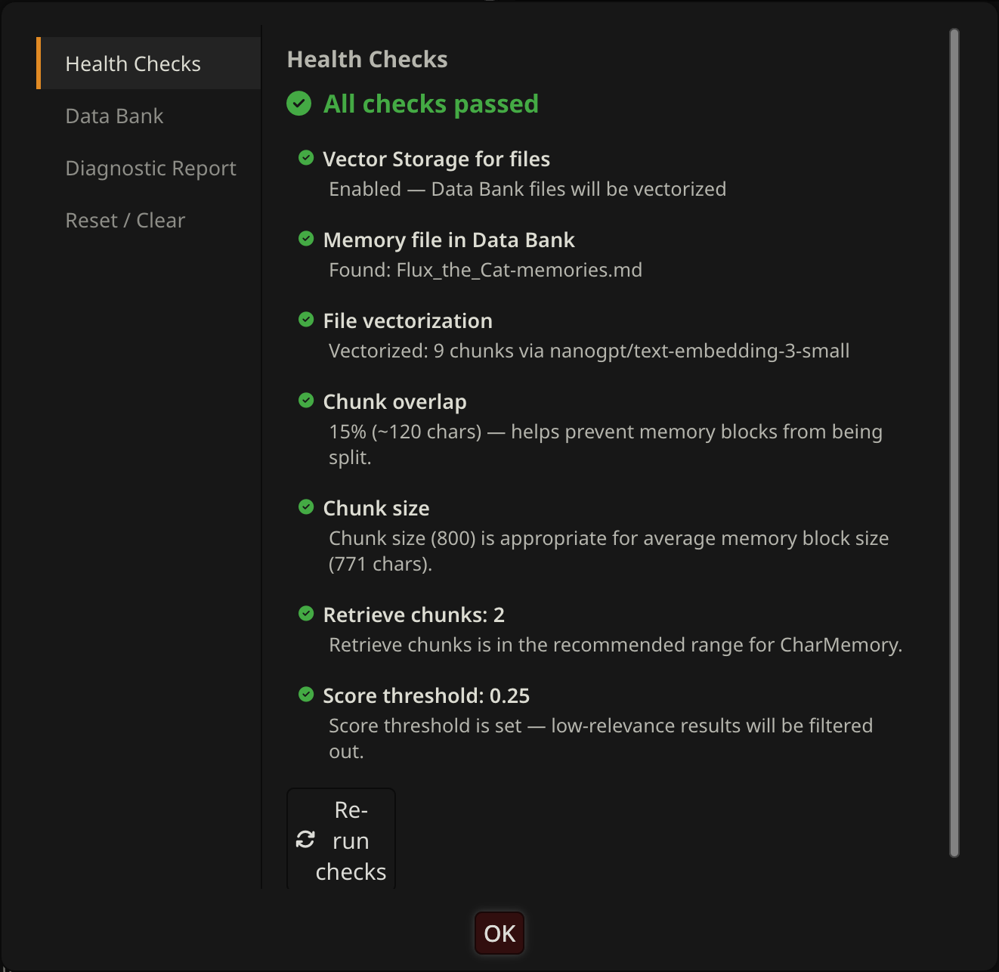

# Troubleshooting

Start with the **health dot** in the CharMemory stats bar — it runs automated checks and tells you what's wrong. If the dot is green, your setup is working correctly. If it's yellow or red, click it to jump to Diagnostics for a check-by-check breakdown.

---

## Health checks

The health dot runs up to 7 checks depending on what data is available. Checks 1–5 run immediately when you open a chat. Checks 6–7 run after at least one generation has been captured.

| Check | What it looks for | States |
|-------|-------------------|--------|
| **Files enabled** | "Enable for files" is on in Vector Storage | RED if off |
| **Memory file exists** | A memory file is in the character's Data Bank | RED if missing |
| **File vectorized** | Memory file has been indexed (chunk count > 0) | YELLOW if 0 chunks (resolves on next generation) |
| **Chunk overlap** | Data Bank overlap setting in Vector Storage | YELLOW if 0% |
| **Chunk size** | Data Bank chunk size in Vector Storage | YELLOW if outside recommended range |
| **Memories injected** | Memory bullets appeared in the last generation | YELLOW if 0 injected (may be normal — score threshold filtering) |
| **Duplicate detection** | Same bullet appears more than once in injected content | YELLOW if duplicates found |

### Fixing each issue

**RED — Files not enabled**
Open Extensions → Vector Storage → under File vectorization settings, check **Enable for files**.

**RED — Memory file not found**
Run an extraction first. The memory file is created on first successful extraction — Extract Now or wait for auto-extraction to fire.

**YELLOW — File not yet vectorized**
The file exists but hasn't been indexed yet. This is normal when a memory file was just created — Vector Storage indexes on the next generation. Just send a message and generate a response. If the check stays yellow after generating, check that your vectorization source is configured and responding. If you recently purged vectors, generate a message to trigger re-indexing.

**YELLOW — No memories injected**
File exists and is vectorized, but 0 memories appeared in the last generation. This can be normal — it means no memories scored above the relevance threshold for the current conversation topic. If you expect memories to be injected, try lowering the score threshold to 0.2 in Vector Storage → Data Bank files row. Also check that **Retrieve chunks** isn't set to 0.

**YELLOW — Chunk overlap is 0%**
With 0% overlap, a memory block landing on a chunk boundary gets split — neither half retrieves cleanly, and you may see duplicate partial bullets in injected content. 0% is a valid starting point (especially with small, topic-tagged blocks), but if you notice split blocks in the Injection Viewer, increase overlap to 10–15% in Vector Storage → Data Bank files. [Purge and re-vectorize](retrieval-and-prompts.md#purge-and-re-vectorize) after changing.

**YELLOW — Chunk size out of range**
Too small: memory blocks get split across chunks. Too large: unrelated blocks share one embedding and retrieval loses precision. See [Retrieval & Prompts → Recommended settings](retrieval-and-prompts.md#recommended-settings) for guidance.

**YELLOW — Duplicates in injected content**
The same memory bullet is appearing multiple times in what's injected. Usually means a block is split across a chunk boundary. Increase chunk overlap and/or adjust chunk size, then purge and re-vectorize.

---

## Common issues

**"0 memories" after extraction**
Check the Activity Log (click **View full log** in the dashboard). It shows exactly what happened — whether the LLM returned `NO_NEW_MEMORIES`, produced unparseable output, or hit an error. Enable **Verbose** in the log to see the full prompt and response.

If verbose mode shows `finish=length` with completion tokens used but no content, you're using a reasoning/thinking model that needs a higher **Max response length** — increase to 2000–3000 in Settings.

**Memories extracted but character doesn't recall them**
Vector Storage isn't configured, or "Enable for files" is off. Check the health dot — RED means something is preventing injection. Open [Retrieval & Prompts](retrieval-and-prompts.md) and work through the setup.

**Extraction never fires automatically**
Check that the **Auto** pill in the panel is active (highlighted). Also verify the message counter is incrementing in the stats bar, and that the cooldown timer isn't blocking it.

**"No unprocessed messages" on Extract Now**
All messages have already been extracted. Use **Reset Extraction State** in Settings → Reset / Clear to re-read from the beginning.

**Memories contain facts already in existing memories**
The extraction prompt sends existing memories as reference with instructions not to repeat them. If the model keeps doing it, it's likely too small to respect the boundary. Switch to a larger model — DeepSeek V3.1 or GLM 4.7.

**Memories reverse who did what**
Same cause — model too small for accurate comprehension. Use a larger model.

**Memories too sparse from a long existing chat**
Expected when batch-extracting hundreds of turns at once — the LLM only sees one chunk at a time and can't judge significance across the full conversation. CharMemory works best extracting incrementally as you chat. For existing chats, try increasing **Messages per LLM call** to 40–50 and re-running batch extraction.

**Memories too granular / play-by-play**
The prompt has a bullet limit and negative examples to prevent this. If it persists, increase **Messages per LLM call** to give the LLM more context per call — more messages means it can better judge what's significant vs. trivial.

**Duplicate memories accumulating in the file**
Use **Consolidate** to merge them. To prevent recurrence, check that [Purge and re-vectorize](retrieval-and-prompts.md#purge-and-re-vectorize) is in your workflow after major memory file changes.

**Memories contain system metadata, relationship tables, or image prompts**
CharMemory strips code blocks, markdown tables, `
` sections, and HTML tags before sending messages to the LLM. If metadata still leaks through, edit the **AVOID** section in the extraction prompt (Settings → Prompts).

---

## Diagnostics

Click the **wrench icon** in the CharMemory panel header to open the Troubleshooter, then go to the **Diagnostics** section. Click **Refresh** after generating a message to capture the current state.

Diagnostics shows:

- **Memory file** — name, whether it exists, bullet and block count, vectorization status and chunk count
- **Injected Memories — Last Generation** — the exact bullets that were injected for the most recent generation. If a memory exists but isn't here, it wasn't semantically relevant enough to pass the score threshold, or Vector Storage settings need adjustment.
- **Character Lorebooks** — lorebook books bound to this character, with entry counts
- **Activated Entries — Last Generation** — which lorebook entries actually fired, based on keyword matches
- **Extension Prompts** — raw content injected by all extensions, including the full `4_vectors_data_bank` entry showing everything Vector Storage sent
- **Injection Health** — the health check card with each check's status and recommendation

> **Group chat caveat**: Diagnostics shows info for the first group member only. To check a specific character, use View / Edit which shows all members.

---

## Generating a diagnostic report

The Troubleshooter can generate a full diagnostic report — a text dump of your current settings, provider configuration, memory file status, and health check results. Use this when asking for help, to give others full context without manually describing your setup.

Click the **wrench icon** → **Diagnostic Report** → copy the output.

---

## Reset tools

> **Before using Clear All Memories**, make a backup. Use SillyTavern's [backup tools](https://docs.sillytavern.app/usage/user-settings/) to snapshot your data directory, or download the memory file from the Data Bank.

See [Managing Memories → Reset and Clear](managing-memories.md#reset-and-clear) for what each reset option does and when to use it. The short version:

- **Reset Extraction State** — re-process messages from the beginning, no memory loss
- **Reset Batch Progress** — re-run batch extraction from scratch, risk of duplicates if memories aren't also cleared
- **Clear All Memories** — deletes the memory file, cannot be undone
